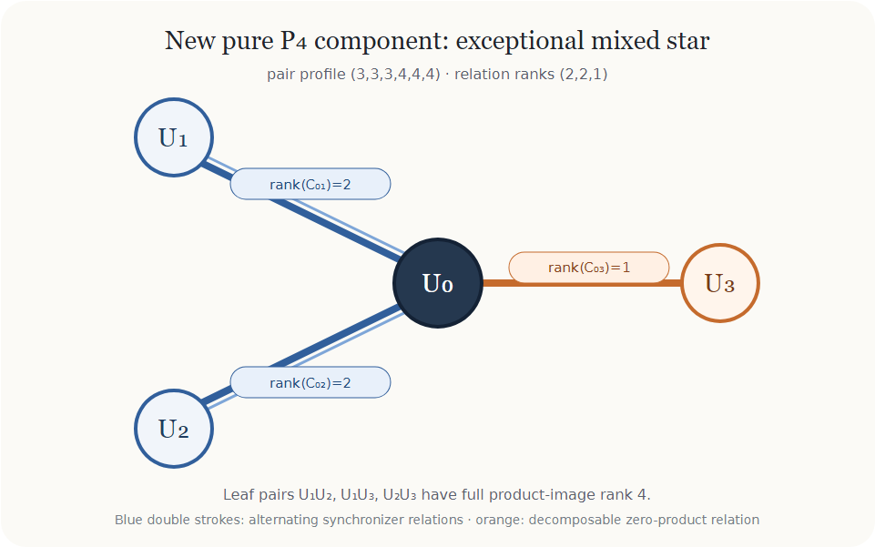

# The tenth pure `P_4` component has no generic marked `H31` lift

## Status

**Exact characteristic-zero generic-component theorem.**  The complete
marked-basis fibre over the generic point of the two-rank-two-spoke
mixed-star component is empty for `H31`.

Together with the earlier component theorems, all ten currently certified
pure-`P_4` component orbits are now generically closed for `H31`.  This does
not close the tenth component's special parameter/projective boundary, its
weighted `H22` fibre, component exhaustiveness, or the global Krenn--Gu
prize problem.



## The toric component and its marked bases

Work over the component function field

```text
K=C(s,t).
```

With

```text
a=X0+X1,  a_bar=X0-X1,
b=X2+X3,  b_bar=X2-X3,
```

the four planes are

```text
U0=span(a+b, b),
U1=span(a+b-b_bar-s a_bar, b-s a_bar),
U2=span(a+b+b_bar-t a_bar, b-t a_bar),
U3=span(b_bar,
        (s+t-1-st,s+t+1+st,-s-t,-s-t)).             (1)
```

Call the first displayed row `alpha_i` and the second `beta_i`.  Every
marked basis compatible with the unique pure factor line is, up to row
scalings,

```text
alpha_i,
beta_i(h)=beta_i+h_i alpha_i,                         (2)
```

for arbitrary `h=(h0,h1,h2,h3)`.  Thus the whole marked chart is the
polynomial ring

```text
S=K[h0,h1,h2,h3].                                    (3)
```

In every basis (2), the only nonzero coefficient of the pure restriction is

```text
T_1111=-4(s+t).                                       (4)
```

## The extension map as a polynomial module

Delete source coordinate `q` and replace it by the fifth source coordinate.
The eight new row entries form a column `z`.  Let

```text
M_q(h) z
```

be the fourteen mixed binary coefficients, and let

```text
A_q(z), B_q(z)
```

be the all-`alpha` and all-`beta(h)` coefficients.  Hence

```text
M_q(h) in Mat_(14 x 8)(S),
A_q,B_q in S^(1 x 8).                                 (5)
```

A genuine binary neighbour must satisfy

```text
M_q(h)z=0,             A_q(z)B_q(z) != 0.             (6)
```

The decisive statement is not a generic minor and not an affine marking
enumeration.  Exact module reduction over `S` gives, for every
`q=0,1,2,3`,

```text
A_q in Row_S(M_q),       B_q notin Row_S(M_q).         (7)
```

Equivalently, there are polynomial row coefficients `c_q(h)` over `K` such
that

```text
A_q=c_q(h) M_q.                                       (8)
```

The reduced row module has ten generators in each of the four cases, and
the exact normal forms are

```text
NF_Mq(A_q)=0,            NF_Mq(B_q) != 0.              (9)
```

Now (8) makes the contradiction immediate.  If `M_q(h)z=0`, then

```text
A_q(z)=c_q(h)M_q(h)z=0,                                (10)
```

contrary to (6).  This holds simultaneously for every marking `h`, including
all divisors on which a convenient maximal minor vanishes.  No ternary-rank
test is needed because the binary neighbour already fails.

## Four visible syzygy lines

The quotient statement in (7) is not merely an opaque normal-form output.
For every marking there is an explicit mixed-zero direction.  In extension
coordinate order

```text
(x0,x1,x2,x3,y0,y1,y2,y3),
```

write `S0=s+t`.  The four directions are

```text
k0=(-1,s-1,t-1,0,
    -h0, h1(s-1)+s, h2(t-1)+t, (s-1)(t-1)),

k1=(-1,-s-1,-t-1,0,
    -h0, -h1(s+1)-s, -h2(t+1)-t, -(s+1)(t+1)),

k2=(-1,0,-2,-1,
    -h0-1,-1,-2h2-1,-h3+S0),

k3=(1,2,0,-1,
    h0+1,2h1+1,1,-h3-S0).                            (11)
```

Direct polynomial identities give

```text
M_q k_q=0,       A_q(k_q)=0,

(B_0(k0),B_1(k1),B_2(k2),B_3(k3))
  =(4S0,4S0,4S0,-4S0).                               (12)
```

Thus the all-`beta` diagonal has a nonzero class in the cokernel while the
all-`alpha` diagonal has zero class.  Formula (12) independently proves the
second half of (7) and explains the geometry: the extension module remembers
the original pure direction but annihilates the opposite Segre vertex.

## What came from the neighbouring mathematics

The useful translation is

```text
graph extension
 -> binary coefficient cube
 -> moving opposite-vertex secant on (P1)^4
 -> row module over the marking chart
 -> one vanishing cokernel class.                     (13)
```

The earlier approach used maximal minors and their exceptional divisors.
Those are Fitting ideals of the same cokernel module; the standard base-change
and presentation viewpoint is recorded in the
[Stacks Project, Section 15.8](https://stacks.math.columbia.edu/tag/07Z6).
Here the syzygy statement (8) is stronger than controlling a Fitting support:
it survives every marking divisor at once.

The two diagonal coefficient directions are opposite decomposable points in
the binary tensor cube, so (6) can also be viewed as an incidence with a
moving Segre secant.  Catalecticant and flattening equations are the usual
way secant geometry is attacked; compare
[Landsberg--Ottaviani](https://arxiv.org/abs/1012.3563).  The present
extension image is special enough that the incidence reduces further to the
module class (7).

Finally, the squarefree algebra

```text
C[X0,X1,X2,X3]/(X0^2,X1^2,X2^2,X3^2)
```

is an Artinian Gorenstein complete intersection.  Its multiplication maps
and annihilator lines put the calculation beside the Hessian/Lefschetz
criterion of [Maeno--Watanabe](https://arxiv.org/abs/0903.3581).  That
literature supplies the right duality language, while the toric mixed-star
normal form and the uniform cokernel identity are specific to this problem.

## Honest frontier

This theorem closes the generic `H31` fibre of the tenth component, not the
global problem.  The active symbolic fronts are now:

1. the tenth component's weighted `H22` fibre;
2. special parameter and Cayley-toric boundary points of that component;
3. pure-`P_4` component exhaustiveness, especially one-rank-two-edge
   triangles and lower pair-image strata;
4. the passage from the complete `P_4` component picture to a global graph
   obstruction.

## Verification

Run:

```text
tmp/codex_verify_env/Scripts/python.exe \
  verify_p5_h31_two_rank_two_spoke_mixed_star_component_generic_obstruction.py

tmp/codex_verify_env/Scripts/python.exe \
  audit_p5_h31_two_rank_two_spoke_mixed_star_component_generic_obstruction.py
```

The primary verifier reconstructs (1)--(5), proves all four global identities
(12), and computes the exact row-module normal forms (9) over
`C(s,t)[h0,h1,h2,h3]`.

The audit imports neither the family constructor nor the mixed-matrix
constructor.  It reconstructs squarefree coefficients by subset dynamic
programming, rechecks (4) and (12) symbolically, and independently proves the
all-marking row-module statement at two rational component points.  Those
specializations are corroboration; the primary function-field module
calculation is the characteristic-zero generic proof.
