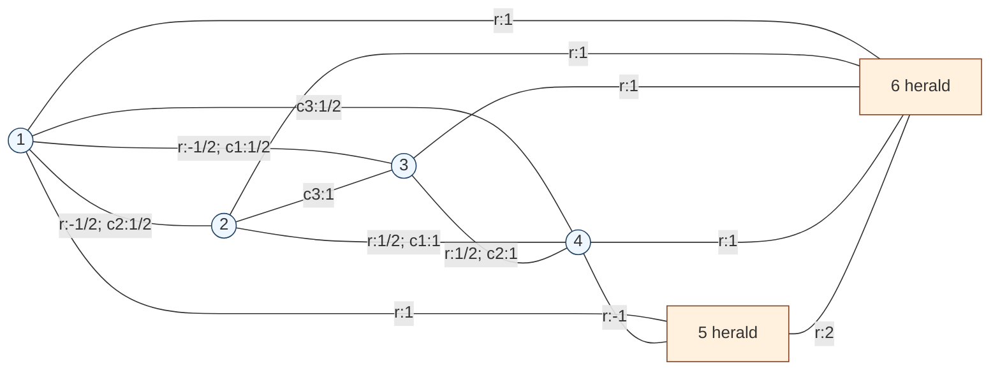

# Exact rational `n=6, k=4, d=4` Question-2 construction

## Status

The graph below is an exact positive witness for Question 2 of Krenn,
Gu, and Soltesz with six vertices, four output vertices, two red
heralds, and four colours.  It was posted by Troy boy
([`@speaktoevil`](https://x.com/speaktoevil/status/2080655946825818276))
in a Twitter/X discussion thread on 2026-07-24 and relayed to this
project on 2026-07-27.  This repository credits that post and does not
claim discovery or priority for the construction.

The author also posted a
[Lean verification](https://x.com/speaktoevil/status/2080707874096099772).
Its public source is
[`yawway365/krenn_graph_q2`](https://github.com/yawway365/krenn_graph_q2),
commit
[`5fba39c19119`](https://github.com/yawway365/krenn_graph_q2/commit/5fba39c19119eaa6e7521deec7b32f1375e21675).
The theorem `kmono_d4_verified` checks all `4^6=4096` colourings against
all 15 perfect matchings using Lean's kernel-level `decide`.  The
standalone Python verifier in this repository is an independent exact
rational replay of the same finite coefficient claim.

This is **not** a counterexample to the global Question-1 Krenn--Gu
conjecture.  Vertices 5 and 6 are fixed red heralds.

Existence at these parameters was already known: the PyTheus project
published an exact four-particle, four-dimensional GHZ construction with
two ancillary particles.  The present graph is nevertheless a different,
especially simple rational construction.  The PyTheus graph has 15
nonzero coloured edge modes and an analytical weighting using
`2^(-1/2)` and `2^(-1/4)`.  This graph has 17 modes, different support,
and weights only in

```text
{-1, -1/2, 1/2, 1, 2}.
```

The comparison establishes that this is not the first `d=4` existence
result.  It does not establish whether this particular rational
realization, or an equivalent one, appeared earlier.

Primary references:

- Question 2 and the definition of `k`-monochromatic:
  <https://mariokrenn.wordpress.com/wp-content/uploads/2019/08/graphquestions.pdf>
- PyTheus paper, submitted in 2022 and published in 2023:
  <https://arxiv.org/abs/2210.09980>
- PyTheus `ghz_446` configuration, which specifies four output
  dimensions and two ancillary particles:
  <https://github.com/artificial-scientist-lab/PyTheus/blob/main/pytheus/graphs/HighlyEntangledStates/ghz_446/config_ghz_446.json>
- PyTheus authors' reduction to their displayed analytical solution:
  <https://github.com/artificial-scientist-lab/PyTheus/blob/main/pytheus/graphs/HighlyEntangledStates/ghz_446/changes.md>
- Original `@speaktoevil` construction:
  <https://x.com/speaktoevil/status/2080655946825818276>
- Upstream Lean certificate:
  <https://github.com/yawway365/krenn_graph_q2/blob/main/KrennQ2D4.lean>

## Construction

The vertices are `1,...,6`.  Vertices `1,...,4` are the output vertices;
vertices 5 and 6 are the heralds.  Every edge below is monochromatic at
its two endpoints.  A repeated vertex pair in different rows represents
parallel coloured edge modes.

```text
colour  pair:weight
r       12:-1/2  13:-1/2  24:1/2  34:1/2
r       15:1     16:1     26:1    36:1    46:1
r       45:-1    56:2
c1      13:1/2   24:1
c2      12:1/2   34:1
c3      14:1/2   23:1
```



The four required inherited colour words are

```text
(r, r, r, r, r, r)
(c1, c1, c1, c1, r, r)
(c2, c2, c2, c2, r, r)
(c3, c3, c3, c3, r, r).
```

## Exact cancellation certificate

There are 15 perfect matchings of six labelled vertices.  Expanding
parallel colour modes leaves 19 nonzero coloured matching terms,
distributed among only nine inherited colour words.  Grouping those
terms gives:

```text
word                    matching contributions                         sum
c1 c1 c1 c1 r r         13,24,56: 1                                    1
c1 r  c1 r  r r         13,24,56: 1/2; 13,26,45: -1/2                  0
c2 c2 c2 c2 r r         12,34,56: 1                                    1
c2 c2 r  r  r r         12,34,56: 1/2; 12,36,45: -1/2                  0
c3 c3 c3 c3 r r         14,23,56: 1                                    1
r  c1 r  c1 r r         13,24,56: -1; 15,24,36: 1                      0
r  c3 c3 r  r r         15,23,46: 1; 16,23,45: -1                      0
r  r  c2 c2 r r         12,34,56: -1; 15,26,34: 1                      0
r  r  r  r  r r         -1/2 + 1/2 - 1/2 + 1/2 + 1/2 + 1/2            1
```

All colour words not shown have no supported matching term and
therefore coefficient zero.  Thus exactly the four required
`4`-monochromatic colourings have unit weight.

## Replay

The standalone verifier enumerates every perfect matching, expands every
parallel colour choice, and sums with Python's exact `Fraction`
arithmetic:

```text
python claims/finite/n06/q2-k4-d4-construction/verify_q2_n6_k4_d4_construction.py
```

It fails closed on any change to the expected coefficient tensor and
prints `"verified": true` only after all exact assertions pass.

## The isolated point belongs to an eight-parameter family

The parameterization in this section is derived in this repository from
the posted support; it is not attributed to the tweet unless separately
documented.  The posted integers are not a numerical coincidence.
Write the red weights as

```text
a=r12  b=r13  c=r24  d=r34
p=r15  q=r16  s=r26  t=r36  u=r46  v=r45  h=r56.
```

The five forbidden supported words give exactly

```text
c h + s v = 0,    b h + p t = 0,
d h + t v = 0,    a h + p s = 0,
p u + q v = 0.
```

After these cancellations, the six all-red matching terms collapse to

```text
red coefficient = 2 p t c.
```

Consequently, for arbitrary nonzero
`h,p,s,t,u,alpha1,alpha2,alpha3`, every full-support solution on this
17-mode topology is parameterized by

```text
r12 = -p s/h                 r13 = -p t/h
r24 =  1/(2 p t)             r34 =  1/(2 p s)
r15 =  p                     r16 =  2 p^2 s t u/h
r26 =  s                     r36 =  t
r46 =  u                     r45 = -h/(2 p s t)
r56 =  h

c1: 13=alpha1, 24=1/(h alpha1)
c2: 12=alpha2, 34=1/(h alpha2)
c3: 14=alpha3, 23=1/(h alpha3).
```

The tweet's weights are the point
`h=2`, `p=s=t=u=1`, and
`alpha1=alpha2=alpha3=1/2`.

More generally, this is a universal weighted four-term module.  For any
prescribed nonzero target amplitudes

```text
(lambda_r, lambda1, lambda2, lambda3),
```

replace

```text
r24 by lambda_r/(2 p t),
r34 by lambda_r/(2 p s),
r16 by 2 p^2 s t u/(lambda_r h),
r45 by -lambda_r h/(2 p s t),
```

and replace the second edge of each `ci` pair by
`lambdai/(h alphai)`.  The five unwanted words still cancel
identically, while the four surviving coefficients are exactly the four
prescribed `lambda` values.  Thus the unit-target family above is an
eight-dimensional fibre inside a twelve-parameter weighted family.

The symbolic verifier independently expands the matching polynomial,
proves all five cancellations identically, proves all four target
coefficients are one, and checks the converse elimination on this fixed
nonzero support:

```text
python claims/finite/n06/q2-k4-d4-construction/verify_q2_n6_k4_d4_family.py
```

## What this teaches us about the prize conjecture

The construction is best viewed as a **heralded cancellation module**:

1. the three non-red target colours occupy the three perfect matchings
   of the four output vertices;
2. the common red edge `56` completes every desired non-red matching;
3. output--herald spokes create five alternating matching exchanges,
   one for each supported unwanted colour word; and
4. once those five exchanges cancel, the all-red amplitude collapses
   from six terms to the single monomial condition `2 p t c=1`.

That explains both its strength and its limitation.  If one tries to
turn vertices 5 and 6 into ordinary output vertices merely by adding a
non-red edge of each colour on `56`, the target output matching of colour
`i` combined with the `56` edge of colour `j` creates a unique forbidden
word

```text
(i,i,i,i,j,j)
```

for every `i != j`.  Its coefficient is a nonzero product and no other
matching on the fixed support can cancel it.  Therefore this topology
cannot be promoted to a Question-1 counterexample by recolouring or
parallelizing only the herald edge.

In tensor language, the naive output-block/herald-edge construction
produces a rank-one outer-product matrix on the three non-red colours,
while the corresponding submatrix of the Question-1 target is the
rank-three identity.  (The full four-colour target across the
`1234 | 56` cut has rank four.)  A genuine counterexample grown from
this seed must add multiple independent interface channels, or create
nonseparable crossing matchings that evade that rank-one factorization.
This motivates a new search branch based on matching-tensor cut rank and
selector gadgets, rather than blind graph enumeration.

The fixed-support rank-one obstruction is replayed by:

```text
python \
  claims/finite/n06/q2-k4-d4-construction/verify_q2_herald_promotion_rank_barrier.py
```
