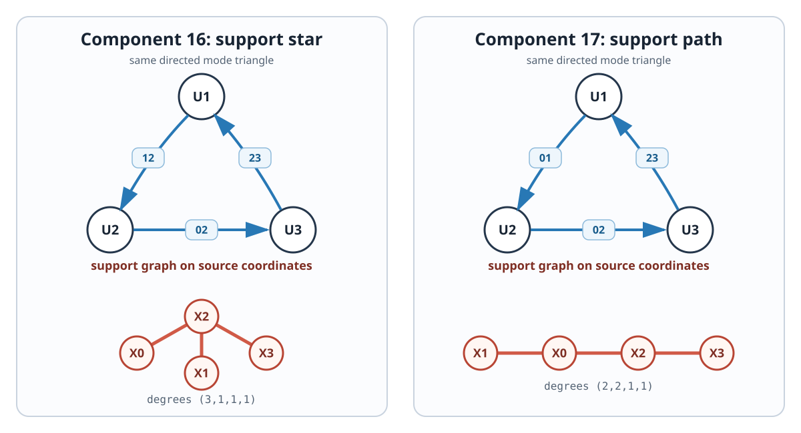

# Two directed-zero-divisor triangle components of pure `P_4`

## Status

**Exact characteristic-zero component theorem.**  The locus of ordered
four-tuples of two-planes on which the order-four permanent restricts to a
nonzero pure tensor has two further generically smooth five-dimensional
irreducible components.

In both components, three modes form a directed triangle of rank-one
zero-product relations and the opposite plane is an apolar `P^2`.  The three
zero-product support labels form, respectively,

```text
K_(1,3)          and          P_4
```

on the four source coordinates.  Their support-degree sequences are

```text
(3,1,1,1)        and          (2,2,1,1).             (1)
```

These sequences are symmetry invariants, so the two components are
inequivalent.  Their relation graph and relation ranks also separate them
from the fifteen previously certified component orbits.  Consequently the
repository now certifies at least

```text
17 symmetry-inequivalent pure-P_4 component orbits.   (2)
```

This is not component exhaustiveness, does not yet close either marked `P_5`
fibre, and does not prove or disprove the global Krenn--Gu prize conjecture.



## The squarefree-algebra normal forms

Work in the Artinian Gorenstein complete intersection

```text
R=C[X_0,X_1,X_2,X_3]/(X_0^2,X_1^2,X_2^2,X_3^2).   (3)
```

Put

```text
a=X_0+X_2,       a_bar=X_0-X_2,
b=X_1+X_2,       b_bar=X_1-X_2,
c=X_2+X_3,       c_bar=X_2-X_3,
d=X_0+X_1,       d_bar=X_0-X_1.                    (4)
```

Thus each barred/unbarred pair is an exact degree-one zero-divisor pair in
`R`.

Use marked row order `(y_i,x_i)=(kernel,active)` on modes `1,2,3`.  The
**star-support triangle** is

```text
U_1=span(b,     c),
U_2=span(a_bar, b_bar),
U_3=span(c_bar, a).                                 (5)
```

The **path-support triangle** is

```text
U_1=span(d,     c),
U_2=span(a_bar, d_bar),
U_3=span(c_bar, a).                                 (6)
```

Both have the same directed relation pattern

```text
y_1 x_2=0,       y_2 x_3=0,       x_1 y_3=0.       (7)
```

The coefficient matrices of all three relations have rank one.  In the
support octahedron `J(4,2)=L(K_4)`, the labels in (5) are

```text
12, 02, 23,
```

which form the three-edge star centered at source coordinate `2`.  The
labels in (6) are

```text
01, 02, 23,
```

which form the path `1--0--2--3`.  This is the finite combinatorial invariant
behind (1).

## Seven cubics become one apolar covector

For a triple of rows from modes `1,2,3`, record its degree-three product as
the covector on the missing fourth row.  In (5), all mixed covectors vanish
and the only two nonzero ones are

```text
C_star=y_1 y_2 y_3=( 1,-1,-1, 1),
D_star=x_1 x_2 x_3=( 1,-1, 1, 1).                  (8)
```

In (6), they are

```text
C_path=y_1 y_2 y_3=( 1, 1,-1, 1),
D_path=x_1 x_2 x_3=(-1, 1,-1,-1).                  (9)
```

Thus purity says only that the opposite plane lies in the apolar
hyperplane `ker C`, while nonvanishing says that it is not contained in
`ker D`.  The parameter space of opposite planes is therefore the open part
of

```text
Gr(2,ker C)=Gr(2,3)=P^2.                            (10)
```

On affine charts of these two projective planes, take

```text
U_0^star=span(
 ( 1-u,1,0,u),
 ( 1-v,0,1,v)),                                    (11)

U_0^path=span(
 (-1-u,1,0,u),
 ( 1-v,0,1,v)).                                    (12)
```

Direct permanent expansion gives

```text
star: T_1111=2,

path: T_0111=2,       T_1111=-2,                   (13)
```

and every coefficient not displayed in (13) is zero.  Hence both families
are nonzero pure restrictions for every finite `(u,v)` in these charts.

This is the main translation across the fence: a sixteen-coefficient
permanent problem becomes a directed cycle of exact zero divisors, followed
by one Macaulay-apolar `P^2`.

## Generic pair geometry

In edge order `01,02,03,12,13,23`, both families have generic pair profile

```text
(4,4,4,3,3,3).                                     (14)
```

For the star family, three full-rank pair minors involving `U_0` are

```text
2(u-1)(u-v),       2uv,       2(v-1).              (15)
```

For the path family, corresponding minors are

```text
2u(u+v+1),       2v(u+v),       2(v-1).            (16)
```

The three triangle nullvectors, in the flattened row order
`(00,01,10,11)`, are identically

```text
(0,1,0,0),       (0,0,1,0),       (0,1,0,0),       (17)
```

which is exactly (7).  Thus the exceptional mode graph is a triangle plus
an isolated vertex, and every exceptional relation has coefficient rank
one.

## Exact component certificates

Apply the projective diagonal source torus

```text
diag(t_0,t_1,t_2,1)                                (18)
```

to (5),(11) or (6),(12).  The parameter space

```text
A^2_(u,v) x (C^*)^3                                (19)
```

is irreducible of dimension five.  At

```text
(u,v,t_0,t_1,t_2)=(2,3,1,1,1),                    (20)
```

use Grassmann pivots

```text
star: ((01),(12),(01),(02)),
path: ((01),(02),(01),(02)).                       (21)
```

In the sixteen chart coordinates, family-Jacobian rows

```text
star: (0,1,2,3,5),       determinant 1/16,
path: (0,1,2,3,4),       determinant 1/8           (22)
```

prove that both family images have dimension five.

Adjoin the unique target Segre point and use the usual fifteen affine
Segre-incidence equations.  At (20), exact `15 x 15` Jacobian minors are

```text
star: -192,
path: 28800.                                       (23)
```

Hence the universal incidence is smooth of dimension `20-15=5` at each
sample.  Each irreducible five-parameter family lies in the unique local
component through its sample and fills that component.  Since a nonzero
pure tensor has a unique projective factor point, projection from the
incidence to `Gr(2,4)^4` preserves the component statement.

## Why these are components sixteen and seventeen

The lower-pair components have a pair image of rank two, so (14) separates
them immediately.  Among the previously known all-pair-rank-at-least-three
components:

- the first, eleventh, and thirteenth components have the same generic pair
  profile but relation-rank multiset `{1,1,2}`;
- the split-cubic and mixed-star components have a three-edge star on the
  **mode** vertices rather than the triangle in (17);
- the two-rank-two-spoke and transverse components have different pair
  profiles or relation-rank words.

Thus no earlier orbit has the mode triangle with relation ranks
`{1,1,1}`.  Finally, the two new components are separated from each other by
the source-support degree sequences (1).  Source permutations preserve the
degree sequence, and mode permutations merely reorder the three labels.

## Where the families were hiding

In the overlapping mixed-orientation chart, the three forbidden
contractions form a `3 x 4` matrix.  Its familiar rank-two locus has five
linear minimal primes.  On four affine lines the matrix drops to rank one,
so its kernel jumps from a plane to a three-space.  The fibre of allowable
opposite planes jumps from one point to

```text
Gr(2,3)=P^2.                                        (24)
```

Three rank-drop lines give (5) or (6), with the two path lines symmetry
equivalent.  The fourth gives the already known first apolar component.
The new components are therefore vertical components of a
determinantal-kernel incidence: they are invisible if one records only the
minimal primes of the rank-two base and substitutes the generic kernel.

This is a small Springer-fibre phenomenon.  The nearby general literature
on determinantal resolutions explains why kernel Grassmannians appear, but
does not identify these permanent-specific vertical components.  Likewise,
Kustin--Striuli--Vraciu's
[exact pairs of homogeneous zero divisors](https://arxiv.org/abs/1304.0411)
provide the homological language for (4),(7), and Elias--Rossi's
[inverse systems of Gorenstein algebras](https://arxiv.org/abs/1705.05686)
provide the broader Macaulay-dual setting for (8)--(12); neither contains
the two normal forms or the component theorem here.

## Exact replay

```text
uv run --with sympy python claims/p4/classifications/verify_p4_directed_zero_divisor_triangle_components.py
python claims/p4/classifications/audit_p4_directed_zero_divisor_triangle_components.py
```

The primary verifier proves all permanent, covector, pair-minor, family
tangent, and characteristic-zero incidence identities.  The independent
audit imports nothing from it: it uses a subset-DP permanent over the
rationals and separately implemented dual-number Jacobians over `F_101`.
Neither program searches a parameter grid or enumerates graphs.
