# Current frontier of the Krenn–Gu conjecture programme

## Status, scope, and authority

The global Krenn–Gu conjecture is **UNRESOLVED**. No complete
characteristic-zero proof and no exact counterexample to the original global
statement is known in this repository.

This is the canonical maintained research map. Its initial consolidation was
reconstructed through PR #82 at merged commit
`367eef49e5917a0f71594dce4c18a608850cdd6a`; subsequent owning advances are
incorporated here as committed. Owning theorem documents are authoritative for
proofs, assumptions, and evidence. This page records how those claims fit
together; it does not replace them or strengthen their scope.
The [theorem ledger](../catalog/theorem-ledger.json) is a partial claim/evidence
index, not the proof graph, and its empty `dependencies` arrays mean “not
recorded.”

Except where an owner says otherwise, the live symbolic trunk below is over
`C` or characteristic zero. Generic/function-field theorems do not include
excluded divisors, projective boundaries, or arbitrary points without a proved
specialization argument.

For even `n >= 6` and `d >= 3`, the conjecture asks whether block matrices
`W_ij in C^(d x d)` can satisfy

```text
T_W(a_1,...,a_n)
  = sum_(perfect matchings M) product_({i,j} in M) W_ij[a_i,a_j]
  = sum_(c=0)^(d-1) product_v 1_(a_v=c).
```

The programme concentrates on the ternary restriction. Every local P5, P6,
or P7 result remains only a local proof leaf until a theorem extracts and
glues that leaf from every hypothetical global witness.

## Live proof topology

Arrows are typed. A `boundary` arrow names a surviving obligation; it is not a
proof of the target. A `specialization` arrow applies only under the owner's
hypotheses.

```mermaid
flowchart TD
  G0["Hypothetical complex witness<br/>global conjecture UNRESOLVED"]

  S1["Balanced complete-deck sensor<br/>PROVED reduction"]
  S2E["Cramer--Euler pair-pole gate<br/>PROVED exact refinement"]
  S2J["Finite pair differential-flatness gate<br/>PROVED exact refinement"]
  S2K["Target-column replacement-minor gate<br/>PROVED exact refinement"]
  S2L["Projective-minimal pair-jet gate<br/>PROVED exact refinement"]
  S2M["Normalized full-row pair controls<br/>PROVED compatibility boundary"]
  S2N["m=3 common-shore image<br/>PROVED iff / ambient separator"]
  S2O["Eight controls -> one binary residual<br/>PROVED reduction"]
  S2P["Binary transverse residual<br/>PROVED empty; eight controls EXCLUDED"]
  S2["Force a refined full-sensor gate failure<br/>OPEN"]
  S3["All balanced partitions rank-drop<br/>OPEN on witness locus"]
  S3D["Diagonal-complete all-rank-drop family<br/>PROVED sharpness, NOT a witness"]
  S3Q["Common-quadratic local-GL orbit<br/>PROVED rank-drop, EXCLUDED from witness locus"]
  S3P["Common-quadric mixed/pure residues<br/>PROVED; common-conformal shore EXCLUDED"]

  M1["Maximum torus-root split<br/>PROVED reduction"]
  M2["r >= 2 fixed-surplus layer<br/>PROVED reduction"]
  PR["Weighted permanent restriction family<br/>OPEN at arbitrary order"]
  PRC["Every co-two permanent product sensor rank-drop<br/>PROVED necessary boundary"]
  O1["Fixed-layer truncation and nonobservability<br/>PROVED boundary"]
  O2["Two-open detector and q=0 star gauge<br/>PROVED boundary"]
  O2P["Projective single-open consecutive lift<br/>PROVED conditional reduction"]
  O2M["Minimum q=0, r=3 row replacement<br/>TWO-OPEN DETECTED conditionally"]
  O2T["q=0, r=4 locally transverse cell<br/>AT LEAST ONE DETECTOR conditionally"]
  O2F["Complete aligned q=0, r=4 cell<br/>AT LEAST ONE DETECTOR conditionally"]
  O2V["q=0, r=5 good-companion activity stratum<br/>AT LEAST ONE DETECTOR conditionally"]
  O2A["q=0, r=5 all-companion root-transverse stratum<br/>AT LEAST ONE DETECTOR conditionally"]
  O2C["Complete locally transverse q=0, r=5 cell<br/>AT LEAST ONE DETECTOR conditionally"]
  O2D["q=0, r=5 one arbitrary or regular-two defects<br/>AT LEAST ONE DETECTOR conditionally"]
  O2E["q=0, r=5 at most two defects except AA/BB<br/>AT LEAST ONE DETECTOR conditionally"]
  O2G["q=0, r=5 at most two defects, all types<br/>AT LEAST ONE DETECTOR conditionally"]
  O2H["q=0, r=5 at most three defects;<br/>A/Z fixed-layer modes impossible<br/>AT LEAST ONE DETECTOR conditionally"]
  O2I["Complete aligned q=0, r=5 cell<br/>AT LEAST ONE DETECTOR conditionally"]
  O3["q=0 r>=6, q>=1,<br/>or unfactorized detector OPEN"]

  U1["r = 1 complete matrix units<br/>PROVED normal form"]
  U1B["Support-minimal GHZ-torus endpoint balance<br/>PROVED"]
  U1C["Actual squared amplitudes moment-balanced<br/>PROVED gauge over C"]
  U2["At-most-four-port response<br/>k = 1, 2, 3 remain OPEN"]
  U3["Globally rigid colour system<br/>CONDITIONAL"]
  U4["Three-block primitive and dual bridges<br/>PROVED"]
  U5["Primitive-alone closure<br/>REFUTED ROUTE"]
  U6["Cross parity, bridges, rigid-head Wick<br/>PROVED reduction"]
  U7A["Nonzero parity fibre has exact word-shore rematching<br/>PROVED"]
  U7B["Cofactor-active cross core<br/>DEEPER / TRANSPORT / PURE CANCEL proved"]
  U7C["Gauge-invariant phase holonomy / pure cofactor flow<br/>PROVED reduction"]
  U7D["Complete pure-target moment-compatible odd holonomy<br/>PROVED sharpness, NOT a witness"]
  U7["Exclude pure-shore cancellation or active holonomy<br/>OPEN"]
  U8["Proper flag propagation<br/>OPEN"]
  D1["Deeper blocker branch<br/>OPEN"]

  A1["Simultaneous balanced all-bridge<br/>CONDITIONAL branch"]
  A2["D-degree <= 4 excluded; D-degree 5 has localized cancellation<br/>full-support degree >= 8"]
  A3["All saturated degrees have localized cancellation<br/>least core bipartite / port-count refined"]
  A4["Extremal sparse least core<br/>opposite extremal theta or aggregate sites"]
  A5["Beta-three sparse route ports<br/>paired singletons / complementary doubletons"]
  A6["Beta-three fixed-completion block<br/>rank three / fibre size never five"]
  A7["Beta-three binomial sign filter<br/>global scalar units / one aligned Q/C2 partition"]
  A8["Beta-three sparse-port primitive lattice<br/>even rank-three fibre / comparison graph"]
  A3R["Least-core complementary response<br/>edgewise zeros / minimum-crossing portals"]

  P5["Local P5 component programme<br/>PARTIAL / boundary-limited"]
  P7["Committed local P7 incidence<br/>criterion proved, outcome OPEN"]
  GL["Universal extraction, synchronization,<br/>and local-to-global gluing OPEN"]
  C2["Automatic characteristic-two lift<br/>REFUTED as a general route"]

  G0 -->|universal reduction| S1
  S1 -->|exact gate refinement| S2E
  S2E -->|finite-jet refinement| S2J
  S2J -->|target-column refinement| S2K
  S2K -->|projective compression| S2L
  S2L -. full-row compatibility .-> S2M
  S2M -->|exact image interface| S2N
  S2M -->|eight-control input| S2O
  S2N -->|common-shore pullback| S2O
  S2O -->|transverse residual obstruction| S2P
  S2P -. eight controls not exhaustive .-> S2
  S1 -->|boundary| S3
  S3 -. pure/local data insufficient .-> S3D
  S3 -->|common-quadratic stratum| S3Q
  S1 -->|common-quadric shore specialization| S3P
  S3Q -. strict special case .-> S3P

  G0 -->|universal reduction| M1
  M1 -->|case r >= 2| M2
  M1 -->|case r = 1| U1
  S1 -->|premise| O1
  M2 -->|premise| O1
  O1 -->|residual refinement| O2
  O2 -->|aligned projective branch| O2P
  O2P -->|permanent reduction| PR
  O2P -->|minimum Hall cell| O2M
  O2P -->|transverse next cell| O2T
  O2P -->|complete four-cell closure| O2F
  O2P -->|five-cell collective transport| O2V
  O2P -->|five-cell pair collision| O2A
  O2P -->|complete transverse five-cell| O2C
  O2P -->|rank-one-mode transport| O2D
  O2T -. strict special case .-> O2F
  O2V -. strict overlapping stratum .-> O2C
  O2A -. strict overlapping stratum .-> O2C
  O2C -. strict special stratum .-> O2D
  O2D -. strict special strata .-> O2E
  O2E -. strict special strata .-> O2G
  O2G -. strict special strata .-> O2H
  O2H -->|remaining-strata closure| O2I
  O2F -->|larger-cell boundary| O3
  O2I -->|larger/unfactorized boundary| O3
  O2 -->|boundary| O3
  M2 -->|zero-surplus specialization| PR
  PR -->|necessary rank-drop boundary| PRC

  U1 -->|reduction| U2
  U1 -->|support-minimal refinement| U1B
  U1B -->|moment-gauge refinement| U1C
  U2 -->|specialization| U3
  U3 -->|premise| U4
  U4 -. primitive alone insufficient .-> U5
  U1 -->|premise| U6
  U2 -->|premise| U6
  U6 -->|exact erasure| M2
  U6 -->|active-fibre refinement| U7A
  U7A -->|exact response| U7B
  U7B -->|phase refinement| U7C
  U7C -->|boundary| U7
  U7C -. stronger sharpness .-> U7D
  U7D -->|remaining mixed equations| U7
  U7B -->|deeper exit| D1
  U1C -. moment-gauge compatibility .-> U7C
  U1C -. compatible sharpness .-> U7D
  U2 -->|boundary| U8
  U2 -->|boundary| D1
  U6 -->|boundary| D1
  U2 -->|simultaneous full flags| A1
  A1 -->|residual refinement| A2
  A2 -->|all-degree localization and core refinement| A3
  U7I -->|port/theta specialization| A3
  A3 -->|extremal sparse shore refinement| A4
  U7I -->|nonzero port partition| A4
  A2 -. full-support density .-> A4
  A4 -->|rank-three route specialization| A5
  U7I -->|weighted port composition| A5
  A3 -. rank-three simplex .-> A6
  A5 -->|route-port block| A6
  U7A -. complete mixed zero fibre .-> A6
  U7K -. conditional fixed completion .-> A6
  A6 -->|completion coverage / rank-three ideal| U7
  A6 -->|integral binomial-lattice containment| A7
  U7F -->|fixed sign quotient| A7
  A7 -->|balanced Q/Q / aligned Q/C2 residual| U7
  A5 -. sparse quartic port coordinates .-> A8
  A6 -->|rank-three complete-fibre lattice| A8
  A7 -->|contained balanced survivors| A8
  U7E -. complete-fibre difference lattice .-> A8
  U7F -. quotient sign criterion .-> A8
  A8 -->|rank at least four / unforced comparisons| U7
  A3 -->|least-core response refinement| A3R
  U7I -->|conformal attachment interface| A3R
  A3R -->|remaining support / target coupling| U7

  PR -->|local specialization only| P5
  PR -->|local specialization only| P7
  P5 -->|open gluing obligation| GL
  P7 -->|open gluing obligation| GL
  G0 -. route boundary .-> C2
```



## Node key

| ID | Live node and exact status | Owning theorem or programme document |
|---|---|---|
| `G0` | Original global conjecture: **UNRESOLVED** | [Problem statement](../README.md#the-conjecture) |
| `S1` | Balanced complete even deck and full-sensor/rank-drop dichotomy: **proved reduction** | [Balanced half-sensor theorem](../claims/arbitrary-order/BALANCED_HALF_SENSOR_COMPLETE_DECK_AND_WICK_GLOBALIZATION_THEOREM.md) |
| `S2E` | On a full sensor, target residuals plus empty normalization, prime-divisor regularity of only the pair components, and one symmetric Euler--hafnian recurrence per higher even subset are **necessary and sufficient** for same-graph globalization | [Cramer--Euler pair-pole gate](../claims/arbitrary-order/BALANCED_FULL_SENSOR_CRAMER_EULER_PAIR_POLE_GATE_THEOREM.md) |
| `S2J` | For each Cramer pair component, prime-divisor regularity is equivalent to finitely many nonendpoint first stresses and endpoint Hessian stresses; in ternary dimension there are `3m+6` polynomial identities per pair, and the physical block is reconstructed uniquely: **proved exact refinement** | [Pair-pole differential flatness](../claims/arbitrary-order/BALANCED_FULL_SENSOR_CRAMER_PAIR_POLE_DIFFERENTIAL_FLATNESS_THEOREM.md) |
| `S2K` | Every cleared pair first or second jet is one selected-column replacement determinant.  After target consistency, its vanishing is equivalent to a differentiated target residual lying in the span of all sensor columns except that pair column: **proved exact refinement** | [Pair-jet replacement minors](../claims/arbitrary-order/BALANCED_FULL_SENSOR_CRAMER_PAIR_JET_REPLACEMENT_MINOR_THEOREM.md) |
| `S2L` | On one projective chart, the full pair-jet gate is equivalent to only the nonpivot outside first stresses and nonpivot endpoint Hessians.  Euler syzygies recover every radial coordinate and hold directly among replacement minors; the uniform count is `(d-1)(m+d-2)`, hence `2m+2` per ternary pair: **proved exact refinement** | [Projective-minimal pair jets](../claims/arbitrary-order/BALANCED_FULL_SENSOR_CRAMER_PAIR_PROJECTIVE_MINIMAL_JET_GATE_THEOREM.md) |
| `S2M` | At `m=3`, complete `27`-row GHZ target consistency, empty normalization, rank four, deck-complement column degrees, and seven vanished retained pair coordinates are compatible with the eighth being nonzero.  Exact controls exist for all eight coordinates, but they are not proved common-shore companion matching-sum sensor realizations: **proved compatibility boundary** | [Normalized full-row controls](../claims/arbitrary-order/BALANCED_FULL_SENSOR_CRAMER_PAIR_EMPTY_NORMALIZATION_CONTROL_COMPATIBILITY_THEOREM.md) |
| `S2N` | At `m=3`, one fixed common shore is characterized exactly by nine singleton slices sharing `A_1 tensor B_23+B_13 tensor A_2+B_12 tensor A_3` and an empty sensor column equal to the six-term permanent of the same cross blocks.  A normalized target-consistent rank-four Latin-plane system lies outside this image, but imposes no retained pair jet: **proved iff and ambient separator** | [Common-shore compatibility theorem](../claims/arbitrary-order/BALANCED_FULL_SENSOR_COMMON_SHORE_SINGLETON_SLICE_AND_EMPTY_PERMANENT_COMPATIBILITY_THEOREM.md) |
| `S2O` | Project every S2M control onto its two nonzero root colours.  All eight become one binary pattern: one transverse pure singleton, zero quiet-colour singleton slices, and one quiet-colour pure empty coefficient.  Thus realization of any control requires one explicit binary image/kernel/permanent system; zero singleton slices alone do not force zero empty coefficient: **proved common residual reduction** | [Normalized control pullback](../claims/arbitrary-order/BALANCED_FULL_SENSOR_COMMON_SHORE_NORMALIZED_PAIR_CONTROL_PULLBACK_REDUCTION.md) |
| `S2P` | For three binary root spaces, a nonzero pure tensor in the common-shore singleton image and a nonzero pure tensor obtained as the polarized permanent of three singleton syzygies must share a factor line.  The S2O tensors are transverse in all three factors, so its residual is empty and none of the eight S2M controls is a common-shore realization: **proved exact obstruction** | [Binary syzygy--permanent obstruction](../claims/arbitrary-order/BALANCED_FULL_SENSOR_COMMON_SHORE_BINARY_SYZYGY_PERMANENT_RESIDUAL_OBSTRUCTION_THEOREM.md) |
| `S2` | Prove every realized full-sensor target incidence fails normalization, one of the retained projective pair target-column-span identities, or an Euler--hafnian recurrence.  S2P excludes the eight ambient coordinatewise controls from the physical image, but they are not an exhaustive parametrization of realized failures: **open** | [S2P exact boundary](../claims/arbitrary-order/BALANCED_FULL_SENSOR_COMMON_SHORE_BINARY_SYZYGY_PERMANENT_RESIDUAL_OBSTRUCTION_THEOREM.md#7-proof-topology-consequence) |
| `S3` | Exclusion of all-balanced rank drop inside the hypothetical-witness locus: **open**; properness is proved only in ambient block-graph space | [Balanced half-sensor theorem](../claims/arbitrary-order/BALANCED_HALF_SENSOR_COMPLETE_DECK_AND_WICK_GLOBALIZATION_THEOREM.md#3-the-proper-closed-all-balanced-boundary) |
| `S3D` | For every `n=2m>=8`, one diagonal-complete graph with invertible blocks, complete support, local concision, and normalized pure coefficients lies in **every** balanced rank-drop locus; its mixed coefficients are nonzero, so it is **not a witness** | [Diagonal-complete sharpness theorem](../claims/arbitrary-order/BALANCED_ALL_RANK_DROP_DIAGONAL_COMPLETE_SHARPNESS_THEOREM.md) |
| `S3Q` | The full vertex-gauge common-quadratic orbit lies in `B_all` for `n>=8` but is **disjoint from the witness equations** for `n>=6`: nondegenerate members have two-flattening rank six versus GHZ rank three, while degenerate members fail local rank | [Common-quadratic orbit exclusion](../claims/arbitrary-order/BALANCED_COMMON_QUADRATIC_ORBIT_RANK_DROP_AND_FLATTENING_EXCLUSION_THEOREM.md) |
| `S3P` | On any balanced shore whose root-root diagonal quadratics share one nondegenerate `Q`, every nonconstant mixed-word cross permanent is **divisible by `Q`**, while each constant word has the exact pure-root residue; every physical common-conformal shore is **excluded**, even with arbitrary internal nonroot blocks, by the nonzero-permanent mixed branch or zero-permanent pure branch | [Common-quadric mixed/pure residue theorem](../claims/arbitrary-order/BALANCED_COMMON_QUADRIC_MIXED_PERMANENT_DIVISIBILITY_AND_CONFORMAL_SHORE_EXCLUSION_THEOREM.md) |
| `M1` | Maximum torus-root saturation and `r=1` / `r>=2` split: **proved universal reduction** | [Maximal torus-root theorem](../claims/arbitrary-order/MAXIMAL_TORUS_ROOT_SATURATION_AND_COORDINATE_ABSORPTION_THEOREM.md) |
| `M2` | One complete fixed-surplus physical hafnian layer; coordinate two-residual absorption: **proved reduction, not exclusion** | [Maximal torus-root theorem](../claims/arbitrary-order/MAXIMAL_TORUS_ROOT_SATURATION_AND_COORDINATE_ABSORPTION_THEOREM.md#2-the-saturated-principal-hafnian-layer) |
| `PR` | Weighted `P_t -> Delta_3` restriction family: **extracted at zero surplus and on the conditional consecutive-lift branch; arbitrary-order exclusion open**. The live `t=6` / P6 restriction remains inside this node; the three-excess notes address only the first strict-support layer, not arbitrary support. | [Maximal-root extraction](../claims/arbitrary-order/MAXIMAL_TORUS_ROOT_SATURATION_AND_COORDINATE_ABSORPTION_THEOREM.md#2-the-saturated-principal-hafnian-layer), [consecutive single-open lift](../claims/arbitrary-order/PROJECTIVELY_CONSTANT_SINGLE_OPEN_CONSECUTIVE_PERMANENT_LIFT_AND_COMPANION_FRAME_THEOREM.md), [P6 package index](../claims/p6/README.md), [three-excess port boundary](../claims/arbitrary-order/ARBITRARY_PERMANENT_THREE_EXCESS_PORT_PERMUTATION_THEOREM.md), and [conformal Birkhoff boundary](../claims/arbitrary-order/ARBITRARY_PERMANENT_THREE_EXCESS_CONFORMAL_BIRKHOFF_REDUCTION.md) |
| `PRC` | Every weighted `P_r -> Delta_3` restriction lies in the simultaneous co-two product-sensor rank-drop locus: for each omitted pair, the complementary sensor has rank at most `binomial(r,2)-1`. This proper necessary boundary is nonempty after imposing local rank and nonzero pure coefficients, so it is **not** a nonrestriction theorem. | [Co-two permanent product-sensor theorem](../claims/arbitrary-order/ARBITRARY_PERMANENT_COTWO_PRODUCT_SENSOR_RANK_DROP_THEOREM.md) |
| `O1` | Contracted truncation, same-fibre rank nonobservability, and single-open absorption: **proved structural boundary** | [Balanced fixed-surplus theorem](../claims/arbitrary-order/BALANCED_FIXED_SURPLUS_TRUNCATION_FIBRE_NONOBSERVABILITY_AND_TRANSVERSE_ABSORPTION_THEOREM.md) |
| `O2` | Complete two-open equation and conditional `q=0` tensor-preserving star gauge: **proved boundary** | [Two-open gauge theorem](../claims/arbitrary-order/BALANCED_TWO_OPEN_ROOT_GAUGE_DETECTOR_AND_STAR_INVISIBILITY_BOUNDARY.md) |
| `O2P` | On the aligned common-two-row, projectively constant branch, the complete single-open identity is a consecutive `P_(m+1)` restriction and its old-root companions form an exact rank-two diagonal quotient frame: **proved conditional reduction** | [Consecutive single-open lift](../claims/arbitrary-order/PROJECTIVELY_CONSTANT_SINGLE_OPEN_CONSECUTIVE_PERMANENT_LIFT_AND_COMPANION_FRAME_THEOREM.md) |
| `O2M` | In the minimum aligned projective cell `q=0,r=3`, the lifted row quotas force `P_3(a,a,b)!=0`, so every nonzero absorption direction at either non-aligned root is **detected by the complete two-open tensor**; this is not a witness exclusion | [Lifted minimum-cell detector](../claims/arbitrary-order/PROJECTIVELY_CONSTANT_LIFT_ROW_QUOTAS_AND_MINIMAL_CELL_TWO_OPEN_DETECTOR_THEOREM.md) |
| `O2T` | In the aligned projective `q=0,r=4` cell, local independence of `a_u,b_u` at all four outside modes makes `h -> P_4(h,a,a,b)` injective; a companion-basis deletion then gives **at least one nonzero two-open detector**. This remains a verified strict special case of `O2F`. | [Transverse four-cell detector](../claims/arbitrary-order/PROJECTIVELY_CONSTANT_LIFT_TRANSVERSE_FOUR_CELL_TWO_OPEN_DETECTOR_THEOREM.md) |
| `O2F` | In the full aligned projective `q=0,r=4` cell, collision quotients plus Hall incidence reduce invisibility to a common outside `a/b` zero; recolouring and local concision exclude it. Hence **at least one nonzero two-open detector** always exists, and all three do when the companions are pairwise independent. This is not a witness exclusion. | [Complete four-cell detector](../claims/arbitrary-order/PROJECTIVELY_CONSTANT_LIFT_COMPLETE_FOUR_CELL_TWO_OPEN_DETECTOR_THEOREM.md) |
| `O2V` | In aligned projective `q=0,r=5`, the four companion equations form an exact symmetric `XL=0` system. Away from a zero companion or balanced `2+2` projective split, modewise three-activity forces **at least one nonzero two-open detector**. Local `a/b` transversality implies activity. This is conditional detection, not full-cell closure or witness exclusion. | [Five-cell collective detector](../claims/arbitrary-order/PROJECTIVELY_CONSTANT_LIFT_FIVE_CELL_COLLECTIVE_COMPANION_AND_ACTIVITY_DETECTOR_THEOREM.md) |
| `O2A` | In locally transverse aligned projective `q=0,r=5`, common-kernel contraction makes a doubly transverse root's five-mode pair-collision map injective. If at most one root is not doubly transverse, all six pair tensors are nonzero, and the rank-two companion zero-edge lemma gives **at least one detector for every companion frame**. This is not witness exclusion. | [Five-cell all-companion pair detector](../claims/arbitrary-order/PROJECTIVELY_CONSTANT_LIFT_FIVE_CELL_PAIR_COLLISION_AND_ALL_COMPANION_DETECTOR_THEOREM.md) |
| `O2C` | In every locally transverse aligned projective `q=0,r=5` cell, weak-root common-kernel trapping plus the exhaustive good/zero/balanced companion split forces a local-concision contradiction if all four collective tensors vanish. Hence **at least one nonzero two-open detector** exists for every companion frame and every root quotient-support pattern. This is not full-cell closure or witness exclusion. | [Complete transverse five-cell detector](../claims/arbitrary-order/PROJECTIVELY_CONSTANT_LIFT_COMPLETE_TRANSVERSE_FIVE_CELL_TWO_OPEN_DETECTOR_THEOREM.md) |
| `O2D` | In aligned projective `q=0,r=5`, a dependent mode with four active deletions forces every invisible companion pattern into one quotient line. A sharp retained four-mode inverse therefore gives **at least one detector** with one arbitrary local defect, or with two defects when at least one has nonzero proportional `a_u,b_u`. This covers every companion/root-support pattern in those strata, but does not exclude a witness. | [Rank-one-mode detector](../claims/arbitrary-order/PROJECTIVELY_CONSTANT_LIFT_RANK_ONE_MODE_AND_REGULAR_TWO_DEFECT_FIVE_CELL_DETECTOR_THEOREM.md) |
| `O2E` | In aligned projective `q=0,r=5`, three active deletions force a quotient-line trap for every companion frame. Exact `A/B/Z` retained collision kernels then give **at least one detector** for the zero-containing `AZ`, `BZ`, `ZZ` cells and the mixed `AB` cell. Together with `O2C` and `O2D`, this detects every at-most-two-defect cell except same-type `AA` and `BB`; it does not exclude a witness. | [Three-activity two-defect detector](../claims/arbitrary-order/PROJECTIVELY_CONSTANT_LIFT_THREE_ACTIVITY_AND_MIXED_DEGENERATE_TWO_DEFECT_FIVE_CELL_DETECTOR_THEOREM.md) |
| `O2G` | In aligned projective `q=0,r=5`, exact row-pair and triple Hall incidence turns the same-type `AA` and `BB` double-kernel survivors into pure-coefficient assignment contradictions. Together with `O2C`, `O2D`, and `O2E`, this gives **at least one detector in every cell with at most two local defects**. It does not exclude a witness. | [Same-type row-incidence detector](../claims/arbitrary-order/PROJECTIVELY_CONSTANT_LIFT_ROW_INCIDENCE_SAME_TYPE_TWO_DEFECT_FIVE_CELL_DETECTOR_THEOREM.md) |
| `O2H` | In aligned projective `q=0,r=5`, row-pair incidence plus the two-singleton `P_5` obstruction excludes every local defect with `b=0`. Exact arbitrary-ratio collision intersections and inactive-set crowding then give **at least one detector in every cell with at most three local defects**, including all `RRR`, `RRB`, `RBB`, and `BBB` three-defect cells. This does not exclude a witness. | [Complete three-defect detector](../claims/arbitrary-order/PROJECTIVELY_CONSTANT_LIFT_COMPLETE_THREE_DEFECT_FIVE_CELL_DETECTOR_THEOREM.md) |
| `O2I` | In the complete aligned common-two-row, projectively constant `q=0,r=5` cell, the lifted `p_a>=2` quota excludes four/five `B` defects. Exact four-/five-defect collision kernels, the all-regular cofactor graph, and a basis-free `3|2` Hall bridge then give **at least one detector in every remaining cell**. The primitive-cube-root `RRRRT` divisor is retained and still has only a one-dimensional common kernel. This does not exclude a witness. | [Complete aligned five-cell detector](../claims/arbitrary-order/PROJECTIVELY_CONSTANT_LIFT_COMPLETE_ALIGNED_FIVE_CELL_TWO_OPEN_DETECTOR_THEOREM.md) |
| `O3` | Conditional aligned `q=0,r=5` detection does not prove witness exclusion or fixed-root injectivity. Every aligned `q=0,r>=6` cell, every `q>=1` cell, and every unfactorized outside graph remains **open** at detector depth. | [Complete aligned five-cell boundary](../claims/arbitrary-order/PROJECTIVELY_CONSTANT_LIFT_COMPLETE_ALIGNED_FIVE_CELL_TWO_OPEN_DETECTOR_THEOREM.md#6-complete-aligned-five-cell-boundary) and [two-open exact boundary](../claims/arbitrary-order/BALANCED_TWO_OPEN_ROOT_GAUGE_DETECTOR_AND_STAR_INVISIBILITY_BOUNDARY.md#6-exact-boundary) |
| `U1` | Complete nonzero one-matrix-unit blocks and forbidden-word cancellation: **proved normal form; exclusion open** | [Maximal-root one branch](../claims/arbitrary-order/MAXIMAL_TORUS_ROOT_SATURATION_AND_COORDINATE_ABSORPTION_THEOREM.md#3-the-maximum-one-monomial-branch) |
| `U1B` | Every globally support-minimal matrix-unit realization is stable against support-erasing diagonal GHZ one-parameter directions. Equivalently, every physical edge occurs with positive integral multiplicity in an endpoint-label multicover whose three positive colour loads are constant across vertices. The multicover weights are not physical amplitudes. | [GHZ diagonal-torus endpoint balance](../claims/arbitrary-order/MATRIX_UNIT_GHZ_DIAGONAL_TORUS_POLYSTABILITY_ENDPOINT_BALANCE_AND_ACTIVE_TRANSPORT_SHARPNESS_THEOREM.md) |
| `U1C` | Over `C`, every support-minimal matrix-unit realization has a unique positive diagonal GHZ gauge modulo the edgewise stabilizer in which the actual squared physical amplitudes have three positive vertex-independent colour loads. This magnitude normal form does not synchronize phases. | [GHZ moment-balanced gauge](../claims/arbitrary-order/MATRIX_UNIT_GHZ_MOMENT_BALANCED_GAUGE_AND_UNIT_PHASE_ACTIVE_TRANSPORT_SHARPNESS_THEOREM.md) |
| `U2` | Globally minimum forbidden word has at most four deviations; exact finite-port response and partial bridges: **proved reduction**. The `k=1`, `k=2`, and `k=3` cells all remain unexcluded; only `k=4` forces rigidity in the base colour. | [Four-switch theorem](../claims/arbitrary-order/MATRIX_UNIT_FOUR_SWITCH_MINIMAL_PORT_AND_PARTIAL_BRIDGE_REDUCTION_THEOREM.md) |
| `U3` | Globally rigid colour factors into a pure hafnian and binary tensor: **proved conditionally; rigidity not forced** | [Rigid-colour boundary](../claims/arbitrary-order/RIGID_COLOUR_COFACTOR_ANNIHILATION_AND_BACKBONE_CANCELLATION_BOUNDARY.md) |
| `U4` | Bi-null cuts, three-block primitive, and dual quadratic bridges: **proved; arbitrary-order exclusion open** | [Rigid primitive theorem](../claims/arbitrary-order/RIGID_COLOUR_THREE_BLOCK_BINARY_PRIMITIVE_AND_QUADRATIC_BRIDGE_THEOREM.md) |
| `U5` | “The primitive alone contradicts the tensor”: **refuted route** for every even order at least eight | [Primitive sharpness theorem](../claims/arbitrary-order/RIGID_COLOUR_THREE_BLOCK_PRIMITIVE_SHARPNESS_AND_DUAL_BRIDGE_COMPLETION_OBSTRUCTION.md) |
| `U6` | Cross-parity erasure, bridge/deeper entry, rigid-head Wick tower, and pseudoforest normal form: **proved reduction** | [Cross-parity theorem](../claims/arbitrary-order/MATRIX_UNIT_CROSS_PARITY_ERASURE_RIGID_HEAD_WICK_AND_BRIDGE_CORE_REDUCTION_THEOREM.md) |
| `U7A` | For every mixed word with nonzero aggregate offdiagonal coefficient, the diagonal contribution factors as the product of three nonzero pure-shore hafnians. Hence every active parity-zero fibre already has an exact word-preserving diagonal rematching; a Tutte failure can occur only in an internally zero fibre. | [Active parity-fibre synchronization theorem](../claims/arbitrary-order/MATRIX_UNIT_PARITY_FIBRE_DIAGONAL_FACTORIZATION_AND_ACTIVE_WORD_SHORE_SYNCHRONIZATION_THEOREM.md) |
| `U7B` | Expanding an active coordinate by its exact off-shore matching produces a cofactor-active physical cross core. Its cross-type counts have one parity, and the imported square/hexagon alternative gives exactly: deeper-blocker entry, transport to another active word with the same multiplicities, or a pure-shore hafnian that cancels despite a nonzero matching term. No-exit transport has a finite active-word cycle. | [Active-word cross-response and bridge-transport trichotomy](../claims/arbitrary-order/MATRIX_UNIT_ACTIVE_WORD_FIBRE_CROSS_MATCHING_RESPONSE_AND_BRIDGE_TRANSPORT_TRICHOTOMY.md) |
| `U7C` | Every active cycle carries a nonzero endpoint-character circulation and a diagonal-gauge-invariant Laurent holonomy. Its fibres are aggregate, or exact binomials force `H=(-1)^m`. Every pure cancellation has a least supported residual whose Euler cofactor flow branches or is a spanning union of alternating even cycles. A sparse exact odd binomial cycle shows this is a phase normal form, not a sign contradiction. | [Phase holonomy and minimal pure-cofactor flow](../claims/arbitrary-order/MATRIX_UNIT_PHASE_HOLONOMY_AND_MINIMAL_PURE_COFACTOR_FLOW_REDUCTION_THEOREM.md) |
| `U7D` | A complete exact eight-vertex `r=1` table simultaneously has all three pure target coefficients, strict positive endpoint balance, a moment-balanced representative over `C`, three proper nonempty nonrigidity sets, and an odd three-fibre binomial cycle with `H=-1`. Its exposed `(7,1,0)` mixed coefficient is transport-isolated, and its only additional zero mixed fibre leaves the selected elimination ideal `(H+1)`. The **complete** `(4,4,0)` block instead has `57` empty, `10` singleton, and exactly `3` binomial fibres, so its Laurent-saturated ideal is `(1)` and the fixed label support is excluded in the cycle's own multidegree. This is a fixed-template theorem, not an arbitrary-cycle exclusion. | [Complete pure-target moment-compatible odd-holonomy sharpness](../claims/arbitrary-order/MATRIX_UNIT_COMPLETE_PURE_TARGET_MOMENT_COMPATIBLE_ODD_HOLONOMY_SHARPNESS_THEOREM.md), [exposed-fibre transport isolation](../claims/arbitrary-order/MATRIX_UNIT_EXPOSED_MIXED_FIBRE_TRANSPORT_ISOLATION_AND_NEIGHBOUR_SHARPNESS_THEOREM.md), and [complete same-multidegree saturation exclusion](../claims/arbitrary-order/MATRIX_UNIT_U7D_COMPLETE_SAME_MULTIDEGREE_TARGET_BLOCK_SATURATION_EXCLUSION_THEOREM.md) |
| `U7E` | For any complete same-multidegree target block, removing one invertible reference matching per nonempty fibre descends the exact ideal to the group algebra of the within-fibre difference lattice, preserving unit status and holonomy elimination even for nonsaturated lattices. A singleton is a unit. An all-binomial block is a unit exactly when its signed relation lattice has an odd kernel dependency; otherwise it is proper and gives exactly `H=(-1)^m`, with no stronger holonomy polynomial. Aggregate fibres remain explicit unresolved Laurent polynomials. | [Complete same-multidegree fibre-lattice reduction and binomial parity dichotomy](../claims/arbitrary-order/MATRIX_UNIT_COMPLETE_SAME_MULTIDEGREE_FIBRE_LATTICE_REDUCTION_AND_BINOMIAL_PARITY_DICHOTOMY_THEOREM.md) |
| `U7F` | For a parity-consistent binomial core containing every fibre of an active binomial cycle, untwisting gives the exact residual group algebra `C[L/L_B]`. Smith torsion splits it into finite character sheets. Quotient free rank zero is completely decided by scalar character evaluations; free rank one is completely decided by univariate Laurent gcds. Killing every sheet gives `(1)`; any surviving sheet leaves exactly `H=(-1)^m`. Aggregate cycle fibres and free rank at least two remain open. | [Binomial-core torsion-sheet and rank-one aggregate quotient](../claims/arbitrary-order/MATRIX_UNIT_BINOMIAL_CORE_TORSION_SHEET_AND_RANK_ONE_AGGREGATE_QUOTIENT_THEOREM.md) |
| `U7G` | Any selected target equations, across arbitrary word multidegrees and including pure anchors, descend faithfully to one global support-difference group algebra. Mixed residuals lie in the endpoint-character kernel; direct-sum difference lattices do not couple even when physical variables overlap. For a fully binomial active cycle, arbitrary extra target equations give only `(1)` or `(H-(-1)^m)`, and the rank-zero/rank-one torsion-sheet criteria apply globally. Cross-multiplicity algebra is exact; cross-multiplicity unit forcing remains open. | [Cross-multiplicity global target lattice and holonomy dichotomy](../claims/arbitrary-order/MATRIX_UNIT_CROSS_MULTIPLICITY_GLOBAL_TARGET_LATTICE_AND_HOLONOMY_DICHOTOMY_THEOREM.md) |
| `U7H` | At a least supported pure hafnian cancellation, the active first-cofactor graph is exactly the allowed-edge graph and is connected and matching-covered. Every active edge lies on a fixed-matching alternating cycle. The degree-two branch is one even cycle with exactly two terms, a primitive signed relation, and monomial first cofactors. The branching branch has at least three matchings, cyclomatic rank at least two, and either two branch sites or one degree-at-least-four site. Neither branch is yet excluded. | [Minimal pure-cofactor matching-covered core and single-cycle theorem](../claims/arbitrary-order/MATRIX_UNIT_MINIMAL_PURE_COFACTOR_MATCHING_COVERED_CORE_AND_SINGLE_CYCLE_THEOREM.md) |
| `U7I` | At every branch vertex of the least pure residual, the residual matchings partition into nonzero cofactor ports. Either every port is a singleton, giving a conformal alternating `d`-fan and one exact `d`-nomial Laurent relation, or some port is an unavoidable nonzero aggregate. Two exits carry exactly an all-odd three-matching theta or an odd/even/even two-matching theta with one exterior-completed port. Exact rational least residuals realize every sparse arity, both cubic theta profiles, and the aggregate alternative, so these pure structures alone are not contradictions. | [Minimal pure-cofactor port aggregate and conformal-fan reduction](../claims/arbitrary-order/MATRIX_UNIT_MINIMAL_PURE_COFACTOR_PORT_AGGREGATE_AND_CONFORMAL_FAN_REDUCTION_THEOREM.md) |
| `U7J` | For an active cycle with aggregate fibres, the outgoing-normalized extra sums `A_i` are gauge invariant and the exact holonomy is `H=(-1)^m product_i(1+A_i)`. Aggregate extra terms may cancel separately, leaving the binomial sign. A complete locally concise eight-vertex matrix-unit family has complete cycle-fibre sizes `5,2,2` and `H=-2/(1+2t)`, so the selected cycle subsystem has zero elimination ideal in `H`. The family fails every pure target and is not a witness; complete-target coupling of the defects remains open. | [Aggregate active-cycle defect factorisation and split-fibre sharpness](../claims/arbitrary-order/MATRIX_UNIT_AGGREGATE_ACTIVE_CYCLE_DEFECT_FACTORISATION_AND_SPLIT_FIBRE_SHARPNESS_THEOREM.md) |
| `U7K` | Every offdiagonal extra matching in an aggregate active-cycle fibre now attaches exactly: a cancelling source or bridge shore contains a conformally minimal primitive cycle, sparse fan, or aggregate port whose terms embed with identical exponent differences into one mixed target fibre; otherwise bridge normalization enters the deeper branch or the complete target equation makes another word active. On a shortest cycle that word is outside the cycle or is the selected successor. The parallel-successor case is sharp even with all pure coefficients one, and can contribute zero new successor-fibre direction; a separate singleton excludes the fixed sharpness support. Universal unit forcing remains open. | [Aggregate extra-matching target attachment](../claims/arbitrary-order/MATRIX_UNIT_AGGREGATE_EXTRA_MATCHING_TARGET_ATTACHMENT_THEOREM.md) |
| `U7L` | If every aggregate extra on an active cycle is diagonal, each diagonal fibre is exactly the Cartesian product of its pure-shore matching sets and its difference lattice is their disjoint-support direct sum. Aggregate size forces a primitive one-shore alternating-cycle direction, but not a vanishing binomial. A complete locally concise twelve-vertex `Q(t)` family has the unique shortest active `3/2/2` cycle, one diagonal extra, all pure coefficients one, shared physical variables, and a saturated direct rank-four fibre lattice with no integer dependency; `H=-1/(1+t)` remains free in the selected-plus-pure subsystem. An outside singleton excludes the fixed support. | [Diagonal aggregate shore product and primitive exchange](../claims/arbitrary-order/MATRIX_UNIT_DIAGONAL_AGGREGATE_SHORE_PRODUCT_AND_PRIMITIVE_EXCHANGE_SHARPNESS_THEOREM.md) |
| `U7` | Force the global target-lattice ideal to be a unit or close a topological exit: turn an attached pure relation into an odd dependency or unit, make a primitive diagonal shore direction meet another target lattice non-directly, use an outside or parallel target equation to kill every quotient sheet, control a rank-at-least-two ideal, or close the deeper branch. This remains **open**: `U7K` covers offdiagonal extras, `U7L` gives the exact diagonal shore-product normal form, `A7` kills every imbalanced binomial-contained A6 block while excluding the two misaligned balanced `Q/C^2` restrictions only on the localized nonzero-port locus, and `A8` makes the sparse-port lattice primitive, excludes odd exact-rank-three contained fibres, and classifies any already-landed comparison carriers. None forces the A6 completion, exact rank three, lattice containment, or a comparison carrier; kills aligned `Q/C^2` or balanced `Q/Q` universally; closes a general rank-at-least-two ideal; or excludes the deeper branch. | [Offdiagonal attachment boundary](../claims/arbitrary-order/MATRIX_UNIT_AGGREGATE_EXTRA_MATCHING_TARGET_ATTACHMENT_THEOREM.md#8-consequence-for-the-live-u7-edge), [diagonal aggregate boundary](../claims/arbitrary-order/MATRIX_UNIT_DIAGONAL_AGGREGATE_SHORE_PRODUCT_AND_PRIMITIVE_EXCHANGE_SHARPNESS_THEOREM.md#7-consequence-for-the-live-u7-edge), [beta-three sign filter](../claims/arbitrary-order/MATRIX_UNIT_ALL_BRIDGE_BETA_THREE_FIXED_COMPLETION_BINOMIAL_SUBLATTICE_PORT_SIGN_DICHOTOMY_THEOREM.md), [sparse-port primitive lattice and comparison graph](../claims/arbitrary-order/MATRIX_UNIT_ALL_BRIDGE_BETA_THREE_SPARSE_PORT_PRIMITIVE_LATTICE_AND_BINOMIAL_COMPARISON_GRAPH_THEOREM.md), and [global cross-multiplicity boundary](../claims/arbitrary-order/MATRIX_UNIT_CROSS_MULTIPLICITY_GLOBAL_TARGET_LATTICE_AND_HOLONOMY_DICHOTOMY_THEOREM.md#7-consequence-for-the-live-u7-edge) |
| `U8` | Proper nonempty colour-nonrigidity sets propagate to all vertices: **open** | [Four-switch partial-bridge theorem](../claims/arbitrary-order/MATRIX_UNIT_FOUR_SWITCH_MINIMAL_PORT_AND_PARTIAL_BRIDGE_REDUCTION_THEOREM.md#5-partial-bridge-systems) |
| `D1` | Deeper double-star/multi-star blocker branch: **open**. Its blocker alternatives are pointwise after shrinking to a dense constructible stratum; no uniform blocker pair is proved on the whole component. | [Double-star lemma](../claims/arbitrary-order/DOUBLE_STAR_ANNIHILATION_LEMMA.md) and [multi-star factorization](../claims/arbitrary-order/MULTI_STAR_BLOCKER_FACTORISATION_LEMMA.md) |
| `A1` | Simultaneous balanced all-bridge system: **proved conditional branch**, not universal extraction | [Three-colour balanced bridge intersection](../claims/arbitrary-order/THREE_COLOUR_BALANCED_BRIDGE_INTERSECTION_THEOREM.md) |
| `A2` | Every all-bridge witness satisfies `deg_G(v)>=deg_D(v)+3`; hence `Delta(G)>=8` and `n>=10`, so maximum full-support degree at most seven is **excluded**. Saturated `Delta(D)<=4` is also **excluded**. The degree-five owner localizes one of three supported pure cancellations and makes the globally least core bipartite subcubic with exact cycle/theta/higher-rank and typed-site refinements. Its later successor `A3` removes the upper-degree restriction only from localization and bipartite-core conclusions; the degree-five subcubic/site structure remains owned here. | [Cubic exclusion](../claims/arbitrary-order/ALL_BRIDGE_ACTIVE_DECK_EXCLUSIVITY_AND_CUBIC_DIAGONAL_EXCLUSION.md), [degree-four exclusion](../claims/arbitrary-order/ALL_BRIDGE_ACTIVE_DECK_MAXIMUM_DEGREE_FOUR_EXCLUSION.md), [universal zero layer](../claims/arbitrary-order/UNIVERSAL_SATURATED_DIAGONAL_ZERO_LAYER_THEOREM.md), and [degree-five/full-support reduction](../claims/arbitrary-order/ALL_BRIDGE_ACTIVE_DECK_MAXIMUM_DEGREE_FIVE_BRANCHING_OR_CANCELLATION_CORE_REDUCTION_THEOREM.md) |
| `A3` | At **every** saturated degree, every simultaneous all-bridge system has a supported pure cancellation localized to an inactive-selected-edge complement, one side of a selected-matching-component/complement cut, or one side of a Hamiltonian-chord-arc/complement cut: **proved exhaustive reduction; all three open as exclusions**. The minimal Hall shore gives two common-cofactor-zero repairs. Independently, every globally least pure core is bipartite; rank one is an even cycle and rank two a closed all-odd theta, while the generic one-open theta is excluded in this specialization. Its perfect-matching polytope has dimension `beta`, so `N>=beta+1`; every branch site with `d<=beta` has a nonzero aggregate port, and a sparse site requires `d=N=beta+1`. Aggregate and extremal sparse strata remain open. | [All-degree localization and bipartite core](../claims/arbitrary-order/ALL_BRIDGE_ACTIVE_DECK_ALL_DEGREE_LOCALIZED_PURE_CANCELLATION_AND_BIPARTITE_CORE_REDUCTION_THEOREM.md) |
| `A4` | If a globally least all-bridge pure core has an extremal sparse site `d=N=beta+1`, that site exhausts its shore excess.  The opposite shore either has one second extremal site and the core is exactly `beta+1` internally disjoint odd routes, or has `2,...,beta-1` lower-degree branch sites, each with a nonzero aggregate port: **proved exhaustive reduction; both open as exclusions**.  At the sparse site `deg_D>=beta+3` and `deg_G>=beta+6`.  At `beta=3` the sparse split is exactly `Q/Q` versus `Q/C^2`; the full five-kernel census has `N in {4,5}`.  Exact least residuals realize both sparse forms, and weighted `K_(3,3)-e` refutes `N=beta+1 => sparse theta`.  These scalar controls are not simultaneous all-bridge witnesses. | [Extremal-sparse opposite-shore dichotomy](../claims/arbitrary-order/ALL_BRIDGE_BIPARTITE_LEAST_CORE_EXTREMAL_SPARSE_OPPOSITE_SHORE_DICHOTOMY_THEOREM.md) |
| `A5` | In the `beta=3` extremal-sparse `Q/Q` or `Q/C^2` core, route parity composes with the nonzero cofactor-port partition.  Odd-route endpoint ports coincide.  In `Q/Q` they are paired singletons with the same nonzero full matching contribution.  In `Q/C^2` the four odd routes pair four singletons, while the unique even route has complementary doubleton ports whose edge-inclusive cofactor sums are nonzero exact negatives: **proved refinement, not an exclusion**.  Bare deletion hafnians, mixed-fibre attachment, independence, and impossibility of either kernel are not proved. | [Beta-three route-port pairing](../claims/arbitrary-order/ALL_BRIDGE_BIPARTITE_LEAST_CORE_BETA_THREE_ROUTE_PORT_PAIRING_THEOREM.md) |
| `A6` | Conditional on one fixed nonzero `U7K`-compatible completion extending all four `beta=3` `Q/Q` or `Q/C^2` core matchings into the same complete mixed zero-target fibre, the injected four-term block has exponent-difference rank three and zero total.  The complete fibre therefore has four terms or at least six, never five; its difference lattice has rank at least three.  In `Q/C^2`, the two complementary doubleton port sums remain nonzero exact negatives.  The normalized formal block is the proper nonunit `1+X+Y+Z`, while its physical evaluation vanishes and its four full exponents have no nontrivial integer affine dependency: **proved conditional composition, not an exclusion**.  Existence of such a completion and control of the remaining rank-at-least-three ideal are open. | [Beta-three fixed-completion mixed-fibre block](../claims/arbitrary-order/MATRIX_UNIT_ALL_BRIDGE_BETA_THREE_ROUTE_PORT_FIXED_COMPLETION_MIXED_FIBRE_RANK_THREE_BLOCK_THEOREM.md) |
| `A7` | Conditional on the A6 fixed-completion branch and integral containment of its free rank-three difference lattice in one parity-consistent same-multidegree binomial-core lattice, the one fixed core character reduces `1+X+Y+Z` to a scalar.  Five of eight possible restrictions are imbalanced and give the global combined-branch unit ideal; the other three are exactly the two-plus/two-minus partitions.  In `Q/C^2`, nonzero complementary doubleton ports leave one aligned balanced partition and exclude the other two only after port localization.  In `Q/Q`, all three balanced restrictions remain: **proved conditional sign filter, not a universal exclusion**.  Neither the fixed completion nor the integral containment is forced. | [Beta-three binomial-sublattice port-sign dichotomy](../claims/arbitrary-order/MATRIX_UNIT_ALL_BRIDGE_BETA_THREE_FIXED_COMPLETION_BINOMIAL_SUBLATTICE_PORT_SIGN_DICHOTOMY_THEOREM.md) |
| `A8` | At the A5 sparse quartic, the three nonreference port coordinates split the free rank-three `A6` difference lattice as a primitive direct summand of the physical edge lattice.  Hence an A6 complete fibre of exact difference rank three has exactly that lattice.  Under the `A7` integral containment, every surviving exact-rank-three complete fibre has even size; odd sizes are excluded, and a six-term fibre has an opposite-sign two-term complement in the binomial-core ideal.  Every physical comparison difference already known to land in the A6 lattice is exactly one sparse port-pair direction.  The resulting graph survives precisely when all edges cross the chosen balanced cut: a within-doubleton comparison closes aligned `Q/C^2`; across the three possible `Q/Q` core restrictions, the inclusion-minimal uniform three-edge closures are a triangle or `K_(1,3)`, while `P_4` is sharp: **proved conditional lattice and comparison refinement, not carrier existence or a universal exclusion**. | [Sparse-port primitive lattice and comparison graph](../claims/arbitrary-order/MATRIX_UNIT_ALL_BRIDGE_BETA_THREE_SPARSE_PORT_PRIMITIVE_LATTICE_AND_BINOMIAL_COMPARISON_GRAPH_THEOREM.md) |
| `A3R` | For every allowed edge `f` of a globally least all-bridge pure core and either other colour `d`, the completed complementary shore satisfies `h_d((V-S) union f)=0`.  If supported, it obeys `2|S|<=n+2` and contains a conformally minimal pure relation attached termwise in one mixed target fibre; if `2|S|>n+2`, every response shore is support-unmatchable.  Opposite-colour active neighbour sets across each core edge are nonempty and disjoint, but need not leave `S`; for a co-two exterior with `|S|>=6`, the exterior-neighbour vertices form only an independent set.  In the original colour, either the complement matches or a minimum-crossing portal has every nonempty induced image unmatchable: **proved response/portal reduction, not an exclusion**. | [Least-core complementary-shore response and portal dichotomy](../claims/arbitrary-order/MATRIX_UNIT_LEAST_CORE_COMPLEMENTARY_SHORE_RESPONSE_AND_PORTAL_DICHOTOMY_THEOREM.md) |
| `P5` | Local `P5 -> Delta_3` component programme: **partial, generic and boundary-limited** | [P5 package index](../claims/p5/README.md) and [obligation ledger](../claims/p5/frontier/P5_DELTA3_OBLIGATION_LEDGER.md) |
| `P7` | One committed legal sensor/incidence pullback: criterion **proved**, algebra outcome **open** | [Committed P7 criterion](../claims/p7/COMMITTED_LEGAL_SENSOR_ORDERED_SECANT_FACTOR_CHOW_NORM_AND_BOUNDARY_TRAP_CRITERION.md) |
| `GL` | Universal extraction, cross-chart/depth synchronization, and local-to-global gluing for the local restriction lanes: **open**. The balanced full-sensor lane instead has the exact same-graph gate `S2E`. | [Top two-port observability boundary](../claims/arbitrary-order/GRAPH_EXTRACTION_TOP_TWO_PORT_SYNCHRONIZATION_OBSERVABILITY_BOUNDARY.md) |
| `C2` | Automatic reduction of arbitrary characteristic-zero solutions to the pinned `F_2` argument: **refuted as a general lemma** | [Characteristic-two route boundary](../claims/arbitrary-order/CHARACTERISTIC_TWO_CONTRACTION_LIFT_OBSTRUCTION.md) |

## Typed-edge table

| Source | Relationship | Target | Exact meaning |
|---|---|---|---|
| `G0` | reduction | `S1` | Every hypothetical ternary witness has a balanced-sensor dichotomy. |
| `S1` | exact refinement | `S2E` | The unique rational full-sensor lift has an exact Cramer target, normalization, pair-pole, and Euler--hafnian gate. |
| `S2E` | exact finite-jet refinement | `S2J` | Prime-divisor regularity of each Cramer pair is equivalent to explicit nonendpoint first stresses and endpoint Hessian stresses; no factorization of the Cramer minor is needed. |
| `S2J` | exact target-column refinement | `S2K` | Every cleared pair jet is an adjugate image and one selected-column replacement determinant; under target consistency, its vanishing is the corresponding full-sensor column-span condition. |
| `S2K` | exact projective compression | `S2L` | Degree-zero and differentiated degree-one Euler syzygies recover the omitted radial first/Hessian coordinates, so only the affine-projective replacement minors remain. |
| `S2L` | ambient full-row compatibility boundary | `S2M` | Eight exact `m=3` controls restore all target rows and empty normalization without making any retained coordinate redundant; the construction stops before the common-shore matching-sum sensor image. |
| `S2M` | exact common-shore image interface | `S2N` | At `m=3` the singleton shared-factor equations and empty six-term permanent are necessary and sufficient for the four shore-sensor columns.  A separate Latin-plane system proves the ambient full-row format is strictly larger, but does not decide any of the eight S2M controls. |
| `S2M` + `S2N` | exact binary pullback | `S2O` | Root-colour projection sends every one of the eight controls to the same necessary binary image/kernel/permanent system.  The reduction neither asserts that this residual is empty nor lifts a binary solution to a ternary common shore. |
| `S2O` | exact transverse residual obstruction | `S2P` | The common binary singleton map has four exhaustive kernel-plane rank types plus the zero-block degenerations.  A pure image tensor and a pure kernel permanent always share a factor line, contradicting the three transverse S2O factor pairs. |
| `S2P` | realized-incidence boundary obligation | `S2` | All eight ambient coordinatewise controls are excluded from the common-shore image, but they do not exhaust realized ways to fail a retained pair identity.  A universal argument must now control arbitrary common-shore target incidences, and higher orders also retain the Euler--hafnian recurrences. |
| `S1` | boundary obligation | `S3` | The all-balanced rank-drop branch is not excluded on the witness locus. |
| `S3` | refutation of argument | `S3D` | Local concision, complete support, invertible blocks, and the pure target coefficients do not force any balanced sensor to have full rank; mixed-word zeros are essential. |
| `S3` | exact stratum exclusion | `S3Q` | Simultaneously vertex-gauge-equivalent common symmetric edge forms are all-rank-drop from `n=8` onward, but flattening rank excludes their entire local-GL orbit from the ternary witness locus; no synchronization theorem for arbitrary `B_all` is inferred. |
| `S1` | conditional stratum obstruction | `S3P` | A common root diagonal quadric makes the all-cross permanent the complete residue modulo `Q`; nonconstant words give zero and constant words give pure-root products.  The two scalar-permanent cases exclude a physical common-conformal shore, but no universal common-quadric or conformal extraction is inferred. |
| `S3Q` | strict special case | `S3P` | The fully synchronized common-quadratic orbit has column-separable cross scalars all equal to one; the newer shore theorem allows arbitrary internal nonroot blocks and varying root/cross scalars and also closes zero permanent by a pure word. |
| `G0` | reduction | `M1` | Maximum-cardinality torus roots give a pointwise exhaustive split. |
| `M1` | case coverage | `M2`, `U1` | The two cases are `r>=2` and `r=1`; neither is excluded by the split. |
| `S1` + `M2` | mathematical premises | `O1` | Rebalancing the fixed layer exposes a truncated contracted sensor. |
| `O1` | residual refinement | `O2` | A second open root gives the exact next detector equation. |
| `O2` | specialization | `O2P` | If the outside two-row factorization is aligned with root `j` and its open shore is projectively constant, the whole single-open equation lifts the fixed `P_m` layer to `P_(m+1)`. |
| `O2P` | reduction | `PR` | The synchronized projective branch is reduced to the same arbitrary weighted-permanent restriction family; no permanent nonrestriction theorem is inferred. |
| `O2P` | conditional cell closure | `O2M` | The repeated-row Hall quotas and adjacent pure/mixed equations close row-replacement vanishing only in the minimum `q=0,r=3` cell; they do not exclude a witness there. |
| `O2P` | conditional cell closure | `O2T` | In `q=0,r=4`, local `a/b` transversality plus a surviving companion basis forces at least one nonzero row-replacement detector; transversality is not derived and no witness is excluded. |
| `O2P` | conditional cell closure | `O2F` | Collision quotients, Hall incidence, recolouring, and local concision close every local-dependence boundary in aligned projective `q=0,r=4`; no witness is excluded. |
| `O2P` | conditional stratum detector | `O2V` | In `q=0,r=5`, the collective companion matrix and deletion activity force at least one nonzero detector away from the two classified companion exceptions; neither activity nor good companions is universal. |
| `O2P` | conditional stratum detector | `O2A` | In locally transverse `q=0,r=5`, pair-collision injectivity and the companion zero-edge lemma cover every companion frame when at most one root has quotient support at most one. |
| `O2P` | conditional cell closure | `O2C` | In locally transverse `q=0,r=5`, weak-root trapping and the exhaustive companion split close every root quotient-support pattern; no witness is excluded. |
| `O2P` | conditional stratum closure | `O2D` | In `q=0,r=5`, rank-one quotient trapping and a retained four-mode inverse close one arbitrary local defect, or two defects with a regular member; no witness is excluded. |
| `O2T` | strict special case | `O2F` | The earlier local-transversality proof remains valid but its extra hypothesis is no longer needed for four-cell detection. |
| `O2V` | strict overlapping stratum | `O2C` | Good companion frames with deletion activity are a strict subcase of the complete locally transverse five-cell detector. |
| `O2A` | strict overlapping stratum | `O2C` | Frames with at most one quotient-sparse root are a strict subcase of the complete locally transverse five-cell detector. |
| `O2C` | strict special stratum | `O2D` | The defect-free five-cell is the locally transverse subcase of the enlarged one-defect/regular-two-defect detector region. |
| `O2D` | strict special strata | `O2E` | The previously detected transverse, one-defect, and regular-two-defect strata sit inside the enlarged at-most-two-defect region; exact three-activity and `A/B/Z` collision kernels add `AB`, `AZ`, `BZ`, and `ZZ`, but not `AA` or `BB`. |
| `O2E` | strict special strata | `O2G` | The mixed and zero-containing two-defect cells sit inside the complete at-most-two-defect detector region; exact pair/triple incidence and pure-support matching add the same-type `AA` and `BB` cells. |
| `O2G` | strict special strata | `O2H` | The complete at-most-two-defect region sits inside the enlarged at-most-three-defect region; fixed-layer incidence excludes `A/Z`, while exact `R/B` common kernels add `RRR`, `RRB`, `RBB`, and `BBB`. |
| `O2H` | remaining-strata closure | `O2I` | The lifted `p_a>=2` row quota removes four/five `B` words; exact four-/five-defect kernels, reciprocal forcing, and the `3|2` Hall bridge add all remaining `R/B` words.  The conclusion is complete conditional detection, not witness exclusion. |
| `O2F` | boundary obligation | `O3` | Four-cell closure does not automatically transport to larger aligned cells, positive surplus, or the unfactorized branch. |
| `O2I` | boundary obligation | `O3` | Complete aligned `q=0,r=5` detection neither excludes a witness nor transports automatically to larger aligned cells, positive surplus, or the unfactorized branch. |
| `O2` | boundary obligation | `O3` | The tight star refutes an automatic detector; higher/unfactorized data are needed. |
| `M2` | specialization | `PR` | Zero surplus yields a tight weighted permanent restriction at arbitrary `r>=5`; it is not reduced to P7. |
| `PR` | necessary condition | `PRC` | Every co-two product sensor is rank-deficient under a restriction. For P6 all fifteen four-mode sensors have rank at most fourteen, but simultaneous rank drop plus local rank and pure nonvanishing is insufficient. |
| `U1` | reduction | `U2` | Matrix-unit cancellation reduces to an at-most-four-port response. |
| `U1` | exact support-minimal refinement | `U1B` | The strict incidence alternative turns every absent positive endpoint balance into an integral GHZ-preserving degeneration that erases a physical edge; global support minimality therefore forces the balance. |
| `U1B` | exact complex-analytic refinement | `U1C` | Strict all-edge balance makes the squared-amplitude exponential functional coercive and strictly convex on the positive GHZ torus modulo its edgewise stabilizer; its unique critical orbit has actual vertex-independent colour loads. |
| `U2` | specialization | `U3` | Only the globally rigid-colour cell enters the deletion-deck factorization. |
| `U3` | mathematical premise | `U4` | Rigid factorization yields the primitive and dual bridges. |
| `U4` | refutation of argument | `U5` | The primitive alone cannot close arbitrary order. |
| `U1` + `U2` | mathematical premises | `U6` | Parity and bridge structure refine the one-root branch. |
| `U6` | reduction | `M2` | Exact erasure may produce a different realization with at least two roots. |
| `U6` | exact refinement | `U7A` | Target equality factors every diagonal word fibre over its pure shores and synchronizes every nonzero aggregate offdiagonal coordinate; internally zero fibres may still contain unsynchronized terms. |
| `U7A` | exact refinement | `U7B` | The complete cross-matching response selects a cofactor-active physical term and bridge-normalizes its parity core, giving the deeper/transport/pure-cancellation trichotomy and finite no-exit holonomy. |
| `U7B` | exact phase refinement | `U7C` | A finite active cycle produces a nonzero endpoint-character circulation; complete binomial fibres impose one Laurent holonomy equation, while aggregate fibres remain explicit. A least supported pure cancellation has a spanning conserved cofactor flow and therefore branches or forms alternating even cycles. |
| `U7C` | exact aggregate-cycle refinement | `U7J` | Complete aggregate cycle equations factor holonomy through gauge-invariant extra-term defects. A split aggregate can retain the binomial sign, while an exact complete physical family shows the cycle subsystem can have zero holonomy elimination. |
| `U7C` | exact pure-cofactor refinement | `U7H` | Minimality identifies the active flow with the connected allowed-edge core. Degree two is one primitive binomial cycle; branching is a connected matching-covered multi-cycle exchange core with quantified excess. |
| `U7H` | exact branch-port refinement | `U7I` | Perfect matchings partition into nonzero cofactor ports. Singleton ports form a conformal alternating fan and an exact sparse Laurent sum; otherwise an aggregate port is forced. Every pair of branch exits carries one of two exact conformal theta profiles. |
| `U7I` | boundary obligation | `U7` | Arbitrary-arity sparse fans, both cubic theta profiles, and aggregate ports all occur in least characteristic-zero pure residuals. Exclusion therefore needs mixed coupling, aggregate control, or genuine deeper-blocker incidence absent from pure topology alone. |
| `U7J` + `U7I` | exact attachment refinement | `U7K` | An offdiagonal aggregate extra either embeds a conformally minimal primitive cycle/fan/aggregate port termwise in mixed response, enters deeper data, or activates its bridge target. Shortest-cycle minimality reduces the last case to an outside word or a parallel successor. |
| `U7J` + `U7A` | exact diagonal-excess refinement | `U7L` | Diagonal fibres factor as Cartesian shore products with disjoint-support shore lattices. Aggregate size forces one primitive shore exchange, while diagonal extras create no bridge arc and the full shore hafnians remain nonzero. |
| `U7K` | boundary obligation | `U7` | Parallel bridge reuse can have zero successor-fibre difference even with all pure coefficients one. Conversion of attached relations into units, forced non-direct overlap, and killed quotient sheets remain open. |
| `U7L` | boundary obligation | `U7` | A unique shortest diagonal-aggregate cycle with all pure anchors can have a saturated direct fibre-lattice sum, no integer dependency, and freely varying holonomy. Closure needs another target equation, a forced proper-subshore cancellation, a unit, or a separately proved deeper exit. |
| `U7K` | exact exit | `D1` | Any selected bridge square or hexagon for the aggregate extra may enter the existing deeper-blocker component. |
| `U7C` | boundary obligation | `U7` | The Laurent holonomy can take the required odd sign and aggregate fibres retain additional summands. The pure-cofactor side is now refined through `U7I`, but further mixed or deeper equations are still needed. |
| `U1C` + `U7C` | refutation of stronger argument | `U7D` | Complete physical support, all pure target coordinates, strict endpoint balance, the actual moment gauge, and three proper nonrigidity sets coexist with an exact odd binomial cycle. The same table has an exposed nonzero mixed coefficient, so only the shortcut is refuted. |
| `U7C` + complete target block | exact lattice reduction | `U7E` | Every normalized fibre lies in the within-fibre difference group algebra. Faithful Laurent extension preserves units and holonomy elimination; singleton and all-binomial blocks are decided exactly by unit/parity alternatives. |
| `U7D` | fixed-template specialization | `U7E` | The complete `(4,4,0)` block lands in the universal singleton branch because it contains ten singleton monomials. Its three-binomial subsystem is parity-consistent and gives only `(H+1)`, while the singleton enlarges the complete block to `(1)`. |
| `U7E` + parity-consistent active binomial cycle | exact aggregate quotient | `U7F` | Untwisting the selected core gives `C[L/L_B]`; finite Fourier sheets and Laurent gcds completely decide residual ideals in quotient free ranks zero and one. |
| `U7E` | boundary obligation | `U7` | The universal reduction does not force a singleton, odd relation, or fully binomial active cycle from response data. Aggregate cycle fibres remain outside the selected binomial-core quotient. |
| `U7F` | boundary obligation | `U7` | The quotient theorem does not force free rank at most one or kill every low-rank sheet; free rank at least two remains multivariate. A continuation must close one of those exact residuals, couple another multidegree, or enter the pure/deeper topology. |
| `U7B` | boundary obligation | `D1` | Any selected square or hexagon may enter the existing deeper-blocker alternative. |
| `U1C` + `U7C` | compatible normal forms | `U7`, `D1` | Moment gauge leaves the active-cycle Laurent monomial invariant and multiplies every cofactor-flow edge on one pure residual by a common nonzero scalar. Magnitude balance and the phase normal forms therefore hold simultaneously, but neither closes the deeper or phase exits. |
| `U2` | boundary obligation | `U8` | Full flags have consequences, but proper nonempty flag sets remain. |
| `U2`, `U6` | boundary obligation | `D1` | Both reductions retain the deeper-blocker alternative. |
| `U2` | specialization | `A1` | Simultaneous full flags for all colours enter all-bridge, absent deeper blockers. |
| `A1` | support-density and degree-five cut refinement | `A2` | Three off-diagonal killers lift `Delta(D)>=5` to full-support `Delta(G)>=8`. At degree five, active-deck and mixed-cut identities localize a supported pure cancellation to an inactive-edge complement, selected-pair component/complement, or Hamiltonian chord-arc/complement cut. Independently, the universal least pure core becomes bipartite subcubic with the cycle/theta/higher-rank split. |
| `A2`, `U7I` | all-degree quantifier and port/core specialization | `A3` | The unconditional lower bound `Delta(D)>=5` makes every selected active-matching triple leave residual saturated support, so the component/Hamiltonian-chord localization needs no upper-degree bound. Saturated bit flips make every least core bipartite; shore excess and the perfect-matching polytope refine U7I's port partition and two theta profiles to the rank-two closed theta and aggregate-port boundary. |
| `U7H`, `U7I`, `A2`, `A3` | extremal sparse opposite-shore refinement | `A4` | Matching-coveredness makes the nontrivial least core 2-connected; A3's shore excess and equality `d=N=beta+1` exhaust one shore; U7I's nonzero port partition forces aggregate ports at every lower-degree opposite site; A2 supplies only the pointwise `deg_G>=deg_D+3` landing.  Neither sparse-shore alternative is excluded. |
| `A4`, `U7I` | exact rank-three route-port refinement | `A5` | A4 supplies the `Q/Q` or `Q/C^2` route kernel, its parities, and `N=4`; U7I supplies the nonzero edge-inclusive port sums.  Their composition pairs odd-route singleton ports and makes the unique `Q/C^2` even-route ports complementary nonzero doubletons with exact-negative sums.  No mixed-target attachment, independence, or kernel exclusion follows. |
| `A3`, `A5`, `U7A`, `U7K` | conditional fixed-completion mixed-fibre composition | `A6` | A3 makes the four core matching exponents an affine rank-three simplex; A5 supplies the exact route-port blocks; U7K supplies exponent-preserving termwise injection under the explicitly assumed common completion; and U7A supplies the complete mixed zero-target coefficient.  The result is a rank-three four-term zero block and a no-five fibre census, not completion existence or an exclusion. |
| `A6` | boundary obligation | `U7` | Force a compatible fixed completion, or control the resulting complete-fibre ideal of difference rank at least three.  The complement may be empty, `1+X+Y+Z` is a proper nonunit, and the three exponent differences have no nonzero integer dependency, so neither a unit nor an odd dependency follows from the block alone. |
| `A6`, `U7F` | conditional binomial-sublattice sign refinement | `A7` | Integral containment of the A6 difference lattice makes the block a single fixed sign-character scalar before the U7F torsion-sheet split.  Imbalanced restrictions are global units.  Balanced `Q/C^2` is further filtered by its nonzero exact-negative doubletons; `Q/Q` has no doubleton filter. |
| `A5`, `A6`, `A7`, `U7E`, `U7F` | sparse-port primitive-lattice and comparison-graph refinement | `A8` | The sparse-port identity minor makes the A6 lattice primitive, so exact complete-fibre rank three collapses to equality.  Under A7 containment a survivor has even fibre size.  Any physical comparison already landing in that lattice becomes one port-pair edge, and the exact balanced-cut graph criterion identifies the Q/C^2 and uniform Q/Q closures.  Rank equality, containment, and the comparison carriers remain assumptions. |
| `A8` | boundary obligation | `U7` | Force the fixed completion, exact rank three, integral containment, and a useful comparison carrier; otherwise control the rank-at-least-four or uncontained fibre ideal.  The aligned `Q/C^2` survivor and all three possible balanced `Q/Q` restrictions remain live when their required comparison graphs are absent. |
| `A3`, `U7I` | exact complementary-shore response and portal refinement | `A3R` | Every allowed least-core edge exposes a nonzero deletion cofactor, so the mixed-cut identity forces two opposite-colour response zeros.  A supported response obeys the global size bound and attaches a conformally minimal cycle/fan/aggregate relation; otherwise it is an exact support obstruction.  Same-colour conformal failure gives a minimum-crossing portal obstruction family. |
| `A3R` | boundary obligation | `U7` | The response family does not force any response shore to be supported, any opposite-colour active neighbour to be exterior, or any two-portal pair to be allowed.  Its cancelling mixed-fibre subrelations and finite portal obstructions still require non-direct target-lattice coupling, a unit, or a genuine deeper exit. |
| `PR` | specialization | `P5`, `P7` | These are two separately developed local lanes. The still-open `r=6` / P6 restriction remains in `PR`, and arbitrary `r>=8` is not reduced to any of these ranks. |
| `P5`, `P7` | open gluing obligation | `GL` | Even complete local exclusions require a theorem connecting every global witness to them. |
| `G0` | refutation of argument | `C2` | Good reduction to the prime field is not automatic, and the source theorem's local correspondence remains pending. |

## Smallest positive next obligations

These are positive theorems or exact decisions that would advance a surviving
branch. They are not an instruction to begin all of them at once.

1. **Balanced full-sensor gate failure.** Starting from the exact Cramer
   target residuals, prove that every target-consistent full sensor violates
   empty normalization, one retained affine-projective target-column-span
   condition, or one higher Euler--hafnian recurrence.  Euler syzygies reduce
   the ternary pair layer to `2m+2` selected-column replacement determinants.
   At `m=3`, exact full-row controls show that all target rows, empty
   normalization, rank, column degrees, and seven retained conditions still
   do not make the eighth condition redundant at the degree-compatible Cramer
   level.  The common-shore image is now written exactly by the singleton
   shared-factor equations and empty six-term permanent, and a Latin-plane
   separator proves that the ambient format is strictly larger.  Every one of
   the eight controls pulls back to the same exact binary
   image/kernel/permanent residual, and the transverse-factor obstruction now
   proves that residual empty.  Thus all eight known ambient coordinatewise
   controls lie outside the physical common-shore image.  They are not an
   exhaustive parametrization of realized pair-gate failure, so the remaining
   bridge is to force a retained determinant nonzero on every arbitrary
   realized balanced target incidence, or derive a smaller exhaustive
   physical alternative.  This obligation does not address the all-balanced
   rank-drop branch.

2. **All-balanced mixed-word exclusion.** Intersect the balanced maximal-minor
   ideals with the full mixed GHZ zero equations and prove emptiness, or derive
   a smaller exact branch.  Complete support, invertible blocks, local
   concision, and the normalized pure coefficients are insufficient by the
   diagonal-complete family; its explicit mixed even-colour coefficients are
   the missing equations.  The whole vertex-gauge common-quadratic orbit is
   now excluded by a `6` versus `3` flattening mismatch, so the surviving
   branch is genuinely nonsynchronized.  More generally, a common root
   quadric forces every nonconstant mixed cross permanent to be divisible by
   that quadric and fixes the constant-word pure residue.  These complementary
   equations exclude the entire physical common-conformal shore, regardless
   of its scalar permanent.  The residual problem must evade common-conformal
   synchronization or satisfy a genuinely nonseparable simultaneous residue
   system.

3. **Zero-surplus permanent restrictions.** Every hypothetical restriction
   now lies in the simultaneous co-two product-sensor rank-drop locus; for P6
   all fifteen four-mode sensors have rank at most fourteen. Decide the mixed
   GHZ equations inside that intersection, exclude `P_r -> Delta_3` for every
   `r>=8` at every legal support size, or prove an exact reduction to ranks
   already closed. The exact P6 block model shows that rank drop, local rank,
   and nonzero pure coefficients alone are insufficient. The committed P7
   sensor and exactly-three-excess support normal forms are not exhaustive
   arbitrary-r theorems.

4. **Active word holonomy and pure-shore cancellation.** Every active
   coordinate has a cofactor-active cross core. Absent the deeper branch,
   bridge normalization either transports activity to a new mixed word with
   the same multiplicities or exposes a pure-shore hafnian that cancels
   despite containing a nonzero matching term; no-exit iteration yields a
   finite nontrivial active-word cycle. In addition, global support
   minimality first forces a positive integral endpoint-label multicover and,
   over `C`, then a positive GHZ gauge with vertex-independent loads of the
   actual squared amplitudes. Intersect that magnitude normal form with the
   full response and deeper-bridge topology to exclude one exit, or use
   additional coefficient identities to make transport impossible. The
   exact unit-phase eight-vertex nonwitness is already moment-balanced,
   retains the local algebra of one ternary bridge-pattern transport, and
   keeps all three nonrigidity sets proper. At the next exact depth, an
   active cycle has a nonzero gauge-invariant Laurent circulation: either a
   fibre has an extra compatible term or binomial fibres force
   `lambda^z=(-1)^m`. A complete eight-vertex table now attains `-1` while
   also having all pure target coordinates, strict endpoint balance, an
   actual moment-balanced representative, and three proper nonrigidity sets.
   Its exposed mixed coefficient is a one-monomial obstruction in
   multiplicity `(7,1,0)`, outside the `(4,4,0)` transport stratum, so it
   rejects that fixed label support without constraining `H`.  The table's
   only additional zero mixed fibre shares cycle variables, but an exact
   `Q(t)` deformation satisfies it and the three cycle equations with
   `H=-1`; the selected elimination ideal in `H` remains `(H+1)`.  Imposing
   the **complete** `(4,4,0)` block on that fixed table gives a different
   outcome: ten singleton fibres make the Laurent ideal `(1)`, so the support
   is excluded before any stronger polynomial in `H` arises.  The arbitrary-
   cycle step is still open because equal multidegree is only a grading, not
   a proved transport closure.  The complete-block fibre-lattice theorem now
   makes every singleton a unit and classifies every all-binomial block by
   exact signed-kernel parity.  For a fully binomial active cycle, the
   binomial-core quotient theorem further decides all residual aggregate
   systems of quotient free rank zero or one by finite torsion characters and
   Laurent gcds.  The global target-lattice theorem then removes the same-
   multidegree restriction: arbitrary mixed blocks share one exact endpoint-
   character-kernel algebra, pure targets add anchor directions, and a proper
   fully binomial-cycle quotient still imposes only the known sign.  What
   remains is to force the combined ideal to be a unit by killing a favourable
   low-rank quotient, controlling free rank at least two or an aggregate cycle
   fibre, proving effective cross-multiplicity unit forcing, or coupling to
   the deeper topology.
   An aggregate active cycle now has the exact defect formula
   `H=(-1)^m product_i(1+A_i)`.  The defects are gauge invariant, but the
   cycle equations alone do not couple them: a complete locally concise
   `5/2/2`-fibre family has `H=-2/(1+2t)` and zero elimination ideal in `H`.
   At `t=1/2`, its aggregate extras cancel separately and the ordinary odd
   sign survives.  The family fails every pure target, so the still-open step
   is to use the remaining target equations to constrain the defect product
   or force the global ideal to be a unit.  For every offdiagonal extra term,
   the new attachment theorem now makes this concrete: a cancelling source
   or bridge shore has a conformally minimal primitive cycle, sparse fan, or
   aggregate port whose matching differences embed termwise in the mixed
   fibre; otherwise the bridge enters deeper data or activates another
   complete target equation.  On a shortest cycle, the active word is outside
   the cycle or is its selected successor.  A pure-anchor-compatible exact
   `3/2/2` family realizes the parallel case with zero new successor-fibre
   difference and variable `H=-1/(1+t)`; its complete target system is killed
   by a separate singleton.  What remains is to force such a unit or useful
   non-direct overlap in general or control distinct parallel successor pairs.
   The complementary diagonal-only case now factors exactly as a Cartesian
   product of pure-shore matching polynomials, with a direct sum of shore
   difference lattices and at least one primitive alternating-cycle
   direction.  A complete pure-anchor-compatible twelve-vertex `3/2/2` family
   makes the selected cycle unique and shortest while its four fibre
   directions remain saturated and independent despite shared physical
   edges; `H=-1/(1+t)` is still free.  Its outside singleton excludes that
   support, but an arbitrary complete-target unit, useful non-direct overlap,
   proper-subshore cancellation, or deeper exit is not yet forced.
   A least pure cancelling residual now has a connected matching-covered
   allowed core.  Its degree-two branch is one primitive binomial cycle with
   monomial cofactors.  At every branching vertex, the multi-cycle core
   further splits into a sparse conformal `d`-fan with an exact `d`-nomial
   relation or a nonzero aggregate cofactor port; its two-exit carriers have
   only the closed all-odd and one-open-port theta profiles.  Exact families
   realize every one of these pure possibilities.  The next pure-side step
   must therefore control an aggregate port or couple a sparse fan character
   to mixed response or genuine deeper-blocker data.

5. **Remaining larger/unfactorized detector.** The complete aligned
   projectively constant `q=0,r=5` cell is now conditionally detected; the
   lifted physical-row quota removes the apparent four-/five-`B` zero before
   the remaining `R/B` words are closed.  Treat `q=0,r>=6` or `q>=1`, or prove
   a legal selector separating the replacement tensors. Outside that branch,
   produce an exact nonzero selector or otherwise exclude the unfactorized
   high-surplus cell.  The existing cell detectors do not exclude a witness.

6. **All-bridge localized cancellations and bipartite least cores.** Every
   saturated degree now has an active-deck-localized supported pure
   cancellation.  Exclude the inactive-edge-complement form using its two
   inactive common-cofactor-zero repairs, or prove simultaneous control of
   both factors of the selected-matching-component/complement and Hamiltonian-
   chord-arc/complement cuts.  Separately, couple a primitive even-cycle or
   closed all-odd-theta relation to mixed response or control a forced nonzero
   aggregate cofactor port.  In the extremal sparse stratum `d=N=beta+1`,
   `A4` reduces the opposite shore to a second extremal odd multi-theta site
   or several lower-degree aggregate sites.  At `beta=3`, `A5` further pairs
   the four odd-route singleton ports and identifies the `Q/C^2` even-route
   aggregates as complementary nonzero doubletons with exact-negative
   edge-inclusive sums.  `A6` now shows that any one compatible fixed
   completion carries those four terms into a rank-three zero block in a
   complete mixed fibre, forces the full fibre size to be four or at least
   six, and preserves the exact-negative doubletons.  `A7` then filters the
   sign restriction whenever that rank-three difference lattice is integrally
   contained in a parity-consistent binomial core: every imbalanced sign
   restriction is a global unit, while balanced `Q/C^2` has only one
   nonzero-port-aligned partition and balanced `Q/Q` retains all three.
   `A8` proves that the sparse-port coordinates make the `A6` lattice
   primitive.  Thus exact complete-fibre rank three collapses to that lattice,
   and, under `A7` containment, every surviving fibre is even; odd sizes
   `7,9,...` are excluded in this conditional branch.  An additional physical
   comparison already landing there is exactly a sparse port-pair edge.  A
   within-doubleton edge closes aligned `Q/C^2`; a predetermined uniform
   `Q/Q` closure needs a triangle or `K_(1,3)`, while `P_4` is sharp.  The next
   step is to force the completion, rank equality, containment, and those
   comparison carriers, or control the rank-at-least-four or uncontained
   ideal.  The complementary fibre may be empty, so neither `A8` nor equality
   `N=beta+1` is a universal exclusion.  The three balanced `Q/Q` cuts are
   alternatives across possible binomial cores, not simultaneous sheets.
   In parallel, `A3R` turns every allowed least-core edge into two exact
   opposite-colour response zeros.  A supported response lands on the
   `2|S|<=n+2` side and attaches a conformally minimal relation to one mixed
   fibre; on the large-shore side all such responses are support-unmatchable.
   Same-colour conformal failure now gives a finite minimum-crossing portal
   family whose every induced nonempty image is unmatchable.  The next honest
   step is to force a supported/aligned response, exploit those portal
   obstructions, or prove new target-lattice coupling.  Active-neighbour
   separation alone does not do this: the active colour's own bit is free,
   and, only for a co-two exterior with `|S|>=6`, the conclusion is an
   independent exterior-neighbour set.
   The globally least core need not retain localized cut labels.  Degree five
   adds subcubic typed sites, but localization and the bipartite rank-one/
   rank-two structure are all-degree.  The deeper-blocker branch remains
   separate.

7. **Component 22 remaining finite-`D23` residual.** The whole generic
   `H=f2=f8=0` cell over `Q(A,R,D)` is now empty: one maximal minor forces
   `h0`, and two further minors have incompatible linear `h3` factors.  This
   includes both `2h3+s=0` and its isolated complement, but it does not close
   special parameter fibres.  Close the remaining `f2=0` residual outside
   `f8=0`, together with its special/projective/source boundaries.  The
   generic finite-`D01` pair orbit is already excluded by its separately
   owned theorem, but its special/projective component fibres remain open. See
   the [generic complete intersection](../claims/p5/h22/unequal-complement-common-kernel-component-d23-f2-f8-generic-complete/P5_H22_UNEQUAL_COMPLEMENT_COMMON_KERNEL_COMPONENT_D23_F2_F8_GENERIC_COMPLETE_OBSTRUCTION.md),
   the [finite-`D01` owner](../claims/p5/h22/unequal-complement-common-kernel-component-d01-pair-orbit/P5_H22_UNEQUAL_COMPLEMENT_COMMON_KERNEL_COMPONENT_D01_PAIR_ORBIT_OBSTRUCTION.md),
   and the [two-minor partial owner](../claims/p5/h22/unequal-complement-common-kernel-component-d23-h1-nonzero-two-minor-factor-cover-partial/P5_H22_UNEQUAL_COMPLEMENT_COMMON_KERNEL_COMPONENT_D23_H1_NONZERO_TWO_MINOR_FACTOR_COVER_PARTIAL_OBSTRUCTION.md).

8. **P4-B3 semantic/composition audit.** Audit the nonzero-pure-factor, symmetry,
   inclusion, and lower-pair quantifiers in the
   [P4 all-pair-rank reduction](../claims/p4/classifications/P4_ALL_PAIR_RANK_EXCEPTIONAL_GRAPH_REDUCTION.md).
   The owner asserts a 25-component exhaustiveness theorem; the independent
   acceptance of those load-bearing quantifiers remains open. Script replay is
   not a substitute for that review.

9. **Committed P7 calculation.** Materialize the residual equations, pull back
   the factor equations, justify properness/finiteness where used, and decide
   `A_good`; proceed to `A_gen^star` only if the criterion requires it. A result
   on this fixed sensor would still need `GL`.

Component 25 is not a closed shortcut: its finite-`D23` three-branch cover is
not an exclusion, and finite-`D01`, special fibres, and projective boundaries
remain open.

Within the `r=1` route, the minimum-word cells `k=1`, `k=2`, and `k=3`
remain distinct positive obligations. The port theorem packages their exact
responses; it does not collapse them into the globally rigid `k=4` cell.

## Refuted or insufficient proof routes

| Route | Exact finding | Owner |
|---|---|---|
| Automatic characteristic-zero to `F_2` reduction | Refuted as a general lemma; good reduction and prime-field residue are not forced | [Characteristic-two boundary](../claims/arbitrary-order/CHARACTERISTIC_TWO_CONTRACTION_LIFT_OBSTRUCTION.md) |
| Fixed surplus determines balanced-sensor rank | False: one fixed-layer fibre can contain deficient and full uncontracted shores | [Fixed-surplus nonobservability](../claims/arbitrary-order/BALANCED_FIXED_SURPLUS_TRUNCATION_FIBRE_NONOBSERVABILITY_AND_TRANSVERSE_ABSORPTION_THEOREM.md) |
| The first two-open equation always detects the affine gauge | False on a conditional tight `q=0` outside-star cell | [Two-open star invisibility](../claims/arbitrary-order/BALANCED_TWO_OPEN_ROOT_GAUGE_DETECTOR_AND_STAR_INVISIBILITY_BOUNDARY.md) |
| Primitive or pure scalar hafnian pencils close the rigid branch | False at arbitrary order; mixed deletion and completion coupling remain essential | [Primitive sharpness](../claims/arbitrary-order/RIGID_COLOUR_THREE_BLOCK_PRIMITIVE_SHARPNESS_AND_DUAL_BRIDGE_COMPLETION_OBSTRUCTION.md) |
| Bogdanov-backbone cancellation alone contradicts equality | False: all selected backbone mixed words can cancel while other words fail | [Rigid-colour cancellation boundary](../claims/arbitrary-order/RIGID_COLOUR_COFACTOR_ANNIHILATION_AND_BACKBONE_CANCELLATION_BOUNDARY.md) |
| Bridge normalization, parity/Wick, or fully active pure cofactors synchronize each individual term | False; exact six-vertex countermechanisms retain unsynchronized compatible terms inside aggregate-zero fibres. Nonzero aggregate fibres are nevertheless word-shore synchronized by the later factorization theorem. | [Word-synchronization boundary](../claims/arbitrary-order/MATRIX_UNIT_BRIDGE_WORD_SYNCHRONIZATION_AND_WICK_SHARPNESS_BOUNDARY.md) and [active parity-fibre refinement](../claims/arbitrary-order/MATRIX_UNIT_PARITY_FIBRE_DIAGONAL_FACTORIZATION_AND_ACTIVE_WORD_SHORE_SYNCHRONIZATION_THEOREM.md) |
| Positive endpoint-label balance turns complex matching cancellation into convexity or excludes active transport | False: the balance weights are incidence-dual multiplicities, not physical amplitudes. A complete balanced eight-vertex nonwitness has pure coefficients `(1,1,1)` and two exact active fibres joined by the forced ternary bridge label pattern, while a different mixed coefficient remains nonzero. It reproduces local transport algebra but makes no geometric deeper-component claim. | [GHZ diagonal-torus endpoint-balance sharpness](../claims/arbitrary-order/MATRIX_UNIT_GHZ_DIAGONAL_TORUS_POLYSTABILITY_ENDPOINT_BALANCE_AND_ACTIVE_TRANSPORT_SHARPNESS_THEOREM.md#3-a-balanced-active-transport-table) |
| Moment-balanced actual squared amplitudes make matching cancellation positive or force every nonrigidity set global | False from those hypotheses alone: an exact Eisenstein unit-phase table has actual load `(3,2,2)` at every vertex, pure coefficients `(1,1,1)`, two active cancellations `1+(-1)=0`, and three proper nonrigidity sets, while an exposed mixed coefficient proves it is not a witness. Full-target propagation remains open. | [GHZ moment-balanced unit-phase sharpness](../claims/arbitrary-order/MATRIX_UNIT_GHZ_MOMENT_BALANCED_GAUGE_AND_UNIT_PHASE_ACTIVE_TRANSPORT_SHARPNESS_THEOREM.md#4-exact-unit-phase-active-transport-table) |
| Binomiality plus completion, pure normalization, moment balance, proper nonrigidity, and one locally coupled neighbouring mixed equation exclude an odd active-word cycle | False: a complete eight-vertex matrix-unit table has all three pure coefficients one, strict balance, a moment-balanced representative, three proper nonempty nonrigidity sets, and three complete fibres `(1,-1)` with `H=-1=(-1)^3`. Its exposed word is transport-isolated, while an exact `Q(t)` deformation also satisfies the table's only additional zero mixed fibre and leaves that selected holonomy elimination ideal `(H+1)`. The **complete** same-multidegree block does reject the fixed table, but by a singleton Laurent unit rather than a stronger holonomy relation; no arbitrary-cycle inference follows. | [Complete moment-compatible odd-holonomy sharpness](../claims/arbitrary-order/MATRIX_UNIT_COMPLETE_PURE_TARGET_MOMENT_COMPATIBLE_ODD_HOLONOMY_SHARPNESS_THEOREM.md), [exposed-fibre transport isolation](../claims/arbitrary-order/MATRIX_UNIT_EXPOSED_MIXED_FIBRE_TRANSPORT_ISOLATION_AND_NEIGHBOUR_SHARPNESS_THEOREM.md), and [same-multidegree saturation exclusion](../claims/arbitrary-order/MATRIX_UNIT_U7D_COMPLETE_SAME_MULTIDEGREE_TARGET_BLOCK_SATURATION_EXCLUSION_THEOREM.md) |
| Shortest-cycle minimality forces every aggregate extra matching to expose a new outside word or a nonzero successor-fibre lattice direction | False: an exact ten-vertex pure-anchor-compatible `3/2/2` family has an offdiagonal extra whose nonzero bridge output is exactly the already selected successor matching, so its successor difference vector is zero. A different singleton target word excludes the fixed support; the family is not a witness. | [Aggregate extra-matching target attachment](../claims/arbitrary-order/MATRIX_UNIT_AGGREGATE_EXTRA_MATCHING_TARGET_ATTACHMENT_THEOREM.md#6-pure-anchor-compatible-parallel-sharpness) |
| A primitive diagonal exchange or shared physical variables force an odd dependency or cross-fibre lattice coupling | False: a complete twelve-vertex `Q(t)` family has the unique shortest active `3/2/2` cycle, one primitive diagonal six-cycle extra, all pure coefficients one, and three shared physical variables, yet a determinant-one minor makes its three fibre lattices a direct saturated rank-four sum with no integer dependency. Its selected holonomy is `-1/(1+t)`; an outside singleton, not the diagonal exchange, excludes the fixed support. | [Diagonal aggregate shore-product sharpness](../claims/arbitrary-order/MATRIX_UNIT_DIAGONAL_AGGREGATE_SHORE_PRODUCT_AND_PRIMITIVE_EXCHANGE_SHARPNESS_THEOREM.md#4-complete-twelve-vertex-sharpness-family) |
| One fixed P7 survivor or incidence result globalizes automatically | False as an inference: one still needs physical edge descent, all Wick equations, and universal extraction | [Balanced sensor Wick gate](../claims/arbitrary-order/BALANCED_HALF_SENSOR_COMPLETE_DECK_AND_WICK_GLOBALIZATION_THEOREM.md) |
| Determinant-cleared Wick identities automatically remove Cramer poles | False: a normalized four-label rational hafnian deck can satisfy the cleared Euler recurrence while one pair has valuation `-1` | [Cramer--Euler pair-pole boundary](../claims/arbitrary-order/BALANCED_FULL_SENSOR_CRAMER_EULER_PAIR_POLE_GATE_THEOREM.md#5-sharp-boundary-cleared-wick-does-not-remove-poles) |
| Either endpoint Hessian flatness alone or nonendpoint transverse flatness alone removes every ambient multihomogeneous pair pole | False in both directions at the rational-section level: an outside degree-zero ratio passes both endpoint Hessians but has a transverse pole, while an endpoint degree-one ratio has no outside dependence but fails an endpoint Hessian. Neither control is realized as a balanced target incidence, so no independent sharpness claim inside the Cramer image follows. | [Pair-pole differential-flatness ambient sharpness](../claims/arbitrary-order/BALANCED_FULL_SENSOR_CRAMER_PAIR_POLE_DIFFERENTIAL_FLATNESS_THEOREM.md#5-ambient-sharpness-both-jet-layers-are-needed-from-degrees-alone) |
| The tautological selected Cramer equation `Af=j` forces a pair replacement minor either to vanish or to be nonzero | False for abstract Cramer systems: diagonal `2 x 2` systems realize both the transverse-pole and endpoint-pole outcomes exactly.  They are not balanced complete-deck sensors with the GHZ target, so no sharpness inside the actual target-incidence image follows. | [Pair-jet replacement-minor boundary](../claims/arbitrary-order/BALANCED_FULL_SENSOR_CRAMER_PAIR_JET_REPLACEMENT_MINOR_THEOREM.md#5-sharp-boundary-cramer-consistency-alone-selects-no-outcome) |
| Complete `27`-row GHZ target consistency, empty normalization, rank, deck-complement column degrees, and seven retained pair conditions make the eighth condition redundant | False at the degree-compatible full-row level: eight exact `m=3` controls separately make each retained coordinate the sole nonzero one.  They are not proved common-shore matching-sum sensor realizations and do not establish sharpness inside actual balanced target incidences. | [Normalized full-row compatibility boundary](../claims/arbitrary-order/BALANCED_FULL_SENSOR_CRAMER_PAIR_EMPTY_NORMALIZATION_CONTROL_COMPATIBILITY_THEOREM.md#5-exact-proof-topology-consequence) |
| Degree-compatible full-row target consistency, empty normalization, and rank imply common-shore matching-sum realizability | False at `m=3`: an exact normalized target-consistent rank-four Latin-plane system has nine independent singleton slices, but their coordinate subspace contains no complete tensor-axis line and cannot equal any common-shore shared-factor subspace.  The separator imposes no retained pair jet and decides no S2M control. | [Common-shore Latin-plane separator](../claims/arbitrary-order/BALANCED_FULL_SENSOR_COMMON_SHORE_SINGLETON_SLICE_AND_EMPTY_PERMANENT_COMPATIBILITY_THEOREM.md#2-a-normalized-full-row-system-outside-the-image) |
| Three vanished singleton slices force the corresponding empty-companion coefficient to vanish | False even in one-dimensional root spaces: three vectors in the plane `u_1+u_2+u_3=0` can have nonzero `3 x 3` permanent.  This does not contradict S2P: its obstruction uses the simultaneous transverse pure tensor in the shared-factor image. | [Normalized control pullback boundary](../claims/arbitrary-order/BALANCED_FULL_SENSOR_COMMON_SHORE_NORMALIZED_PAIR_CONTROL_PULLBACK_REDUCTION.md#3-the-exact-residual-obligation), [binary residual obstruction](../claims/arbitrary-order/BALANCED_FULL_SENSOR_COMMON_SHORE_BINARY_SYZYGY_PERMANENT_RESIDUAL_OBSTRUCTION_THEOREM.md#6-sharpness-of-the-shared-factor-conclusion) |
| Local concision, complete support, invertible blocks, and normalized pure coefficients force some balanced sensor to be full | False for every `n>=8`: the diagonal-complete family has all these properties and rank at most `binomial(m,2)+1` on every cut; it fails explicit mixed-word zero equations | [Diagonal-complete all-rank-drop boundary](../claims/arbitrary-order/BALANCED_ALL_RANK_DROP_DIAGONAL_COMPLETE_SHARPNESS_THEOREM.md) |
| Independent local basis changes can rescue the common-quadratic all-rank-drop mechanism as a witness | False: the synchronized orbit has two-vertex flattening rank six when nondegenerate, invariant under every local isomorphism, while ternary GHZ has rank three; degenerate forms already fail local rank | [Common-quadratic orbit exclusion](../claims/arbitrary-order/BALANCED_COMMON_QUADRATIC_ORBIT_RANK_DROP_AND_FLATTENING_EXCLUSION_THEOREM.md) |
| Arbitrary internal nonroot blocks can repair a common-conformal balanced shore | False: modulo the common root quadric every non-all-cross sector vanishes; nonzero scalar permanent leaves a forbidden mixed product, while zero permanent contradicts the nonzero pure-root product from a constant word | [Common-quadric mixed/pure residue theorem](../claims/arbitrary-order/BALANCED_COMMON_QUADRIC_MIXED_PERMANENT_DIVISIBILITY_AND_CONFORMAL_SHORE_EXCLUSION_THEOREM.md) |
| Simultaneous co-two permanent sensor rank drop, local rank, and nonzero pure coefficients exclude P6 | False as an argument: an exact two-block coordinate model has all fifteen four-mode sensors of dimension at most nine and all pure coefficients nonzero, but has mixed support and flattening rank one rather than the target rank three | [Co-two permanent product-sensor boundary](../claims/arbitrary-order/ARBITRARY_PERMANENT_COTWO_PRODUCT_SENSOR_RANK_DROP_THEOREM.md#5-sharpness-of-what-rank-drop-alone-can-say) |
| Only equal regular ratios survive the four-regular five-cell common kernel | False: a `2+2` reciprocal primitive-cube-root divisor also gives a one-dimensional kernel; the corrected dimension bound still closes detection | [Complete aligned five-cell detector](../claims/arbitrary-order/PROJECTIVELY_CONSTANT_LIFT_COMPLETE_ALIGNED_FIVE_CELL_TWO_OPEN_DETECTOR_THEOREM.md#lemma-2-four-defect-full-common-kernels) |

These are refutations of arguments, not counterexamples to the Krenn–Gu
conjecture.

## Evidence, disagreements, and maintenance

- The P4 owner asserts a 25-component exhaustiveness theorem. The programme
  retains P4-B3 as a human semantic/composition audit of its load-bearing
  quantifiers. This is an audit-acceptance gap, not an automatic mathematical
  contradiction and not permission to call the cover either unproved or fully
  audited without qualification.
- Several P5 results are generic/function-field or divisor-specific. Package
  colocation, a component count, or a finite certificate does not close their
  special and projective boundaries.
- The external characteristic-two Lean project is source-inspected candidate
  evidence here; local build replay and statement correspondence remain
  pending. The local algebraic route obstruction is independent of accepting
  that external formalization.
- `primary_verifier` and `independent_audit` are evidence roles, not
  mathematical premises. Bounded checks do not prove arbitrary-order prose.
- Any PR that changes a node, edge, open leaf, route refutation, or local/global
  scope on this page must update it. A PR that changes mathematical claims but
  leaves this live frontier unchanged must explicitly state why no frontier
  update is needed. The owning claim document must change when the theorem
  itself changes.

The detailed reconstruction, reviewer disagreements, relocation inventory,
and PR #72–#82 evidence are in the
[programme proof-topology audit](audits/PROGRAMME_PROOF_TOPOLOGY_AUDIT_2026-08-10.md).
The superseded chronology remains available in the
[2026-08-05 frontier snapshot](history/current-frontier-stabilization-snapshot-2026-08-05.md)
and [2026-08-10 handoff](history/handoffs/SYMBOLIC_PROGRAM_HANDOFF_2026-08-10.md).
