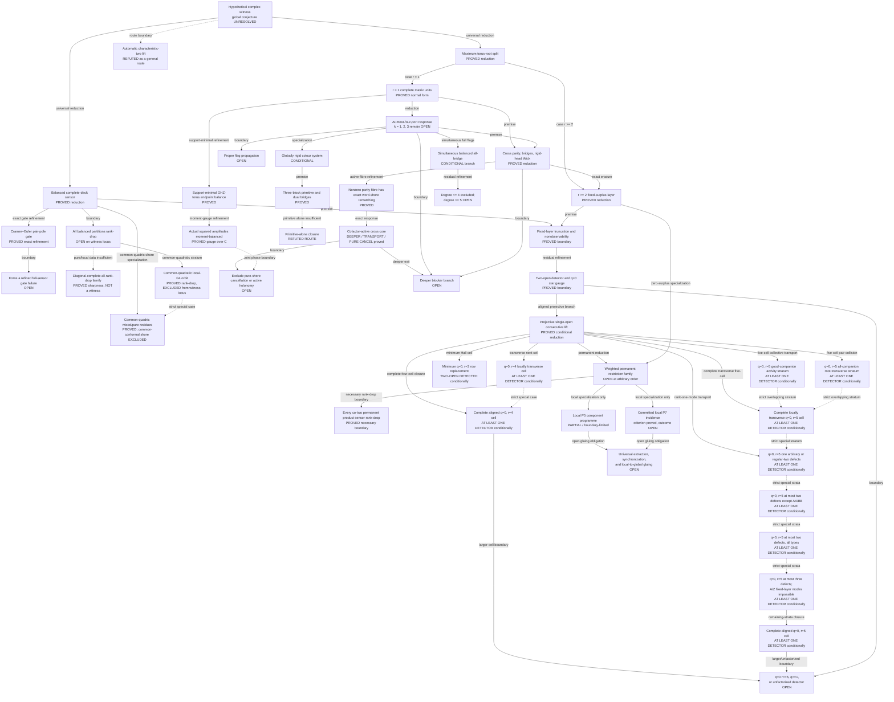

# Current frontier of the Krenn–Gu conjecture programme

## Status, scope, and authority

The global Krenn–Gu conjecture is **UNRESOLVED**. No complete
characteristic-zero proof and no exact counterexample to the original global
statement is known in this repository.

This is the canonical maintained research map. Its initial consolidation was
reconstructed through PR #82 at merged commit
`367eef49e5917a0f71594dce4c18a608850cdd6a`; subsequent owning advances are
incorporated here as committed. Owning theorem documents are authoritative for
proofs, assumptions, and evidence. This page records how those claims fit
together; it does not replace them or strengthen their scope.
The [theorem ledger](../catalog/theorem-ledger.json) is a partial claim/evidence
index, not the proof graph, and its empty `dependencies` arrays mean “not
recorded.”

Except where an owner says otherwise, the live symbolic trunk below is over
`C` or characteristic zero. Generic/function-field theorems do not include
excluded divisors, projective boundaries, or arbitrary points without a proved
specialization argument.

For even `n >= 6` and `d >= 3`, the conjecture asks whether block matrices
`W_ij in C^(d x d)` can satisfy

```text
T_W(a_1,...,a_n)
  = sum_(perfect matchings M) product_({i,j} in M) W_ij[a_i,a_j]
  = sum_(c=0)^(d-1) product_v 1_(a_v=c).
```

The programme concentrates on the ternary restriction. Every local P5, P6,
or P7 result remains only a local proof leaf until a theorem extracts and
glues that leaf from every hypothetical global witness.

## Live proof topology

Arrows are typed. A `boundary` arrow names a surviving obligation; it is not a
proof of the target. A `specialization` arrow applies only under the owner's
hypotheses.



## Node key

| ID | Live node and exact status | Owning theorem or programme document |
|---|---|---|
| `G0` | Original global conjecture: **UNRESOLVED** | [Problem statement](../README.md#the-conjecture) |
| `S1` | Balanced complete even deck and full-sensor/rank-drop dichotomy: **proved reduction** | [Balanced half-sensor theorem](../claims/arbitrary-order/BALANCED_HALF_SENSOR_COMPLETE_DECK_AND_WICK_GLOBALIZATION_THEOREM.md) |
| `S2E` | On a full sensor, target residuals plus empty normalization, prime-divisor regularity of only the pair components, and one symmetric Euler--hafnian recurrence per higher even subset are **necessary and sufficient** for same-graph globalization | [Cramer--Euler pair-pole gate](../claims/arbitrary-order/BALANCED_FULL_SENSOR_CRAMER_EULER_PAIR_POLE_GATE_THEOREM.md) |
| `S2` | Prove every full-sensor target incidence fails normalization, a pair-pole test, or an Euler--hafnian recurrence: **open** | [Cramer--Euler pair-pole gate, exact frontier](../claims/arbitrary-order/BALANCED_FULL_SENSOR_CRAMER_EULER_PAIR_POLE_GATE_THEOREM.md#6-proof-topology-consequence-and-exact-frontier) |
| `S3` | Exclusion of all-balanced rank drop inside the hypothetical-witness locus: **open**; properness is proved only in ambient block-graph space | [Balanced half-sensor theorem](../claims/arbitrary-order/BALANCED_HALF_SENSOR_COMPLETE_DECK_AND_WICK_GLOBALIZATION_THEOREM.md#3-the-proper-closed-all-balanced-boundary) |
| `S3D` | For every `n=2m>=8`, one diagonal-complete graph with invertible blocks, complete support, local concision, and normalized pure coefficients lies in **every** balanced rank-drop locus; its mixed coefficients are nonzero, so it is **not a witness** | [Diagonal-complete sharpness theorem](../claims/arbitrary-order/BALANCED_ALL_RANK_DROP_DIAGONAL_COMPLETE_SHARPNESS_THEOREM.md) |
| `S3Q` | The full vertex-gauge common-quadratic orbit lies in `B_all` for `n>=8` but is **disjoint from the witness equations** for `n>=6`: nondegenerate members have two-flattening rank six versus GHZ rank three, while degenerate members fail local rank | [Common-quadratic orbit exclusion](../claims/arbitrary-order/BALANCED_COMMON_QUADRATIC_ORBIT_RANK_DROP_AND_FLATTENING_EXCLUSION_THEOREM.md) |
| `S3P` | On any balanced shore whose root-root diagonal quadratics share one nondegenerate `Q`, every nonconstant mixed-word cross permanent is **divisible by `Q`**, while each constant word has the exact pure-root residue; every physical common-conformal shore is **excluded**, even with arbitrary internal nonroot blocks, by the nonzero-permanent mixed branch or zero-permanent pure branch | [Common-quadric mixed/pure residue theorem](../claims/arbitrary-order/BALANCED_COMMON_QUADRIC_MIXED_PERMANENT_DIVISIBILITY_AND_CONFORMAL_SHORE_EXCLUSION_THEOREM.md) |
| `M1` | Maximum torus-root saturation and `r=1` / `r>=2` split: **proved universal reduction** | [Maximal torus-root theorem](../claims/arbitrary-order/MAXIMAL_TORUS_ROOT_SATURATION_AND_COORDINATE_ABSORPTION_THEOREM.md) |
| `M2` | One complete fixed-surplus physical hafnian layer; coordinate two-residual absorption: **proved reduction, not exclusion** | [Maximal torus-root theorem](../claims/arbitrary-order/MAXIMAL_TORUS_ROOT_SATURATION_AND_COORDINATE_ABSORPTION_THEOREM.md#2-the-saturated-principal-hafnian-layer) |
| `PR` | Weighted `P_t -> Delta_3` restriction family: **extracted at zero surplus and on the conditional consecutive-lift branch; arbitrary-order exclusion open**. The live `t=6` / P6 restriction remains inside this node; the three-excess notes address only the first strict-support layer, not arbitrary support. | [Maximal-root extraction](../claims/arbitrary-order/MAXIMAL_TORUS_ROOT_SATURATION_AND_COORDINATE_ABSORPTION_THEOREM.md#2-the-saturated-principal-hafnian-layer), [consecutive single-open lift](../claims/arbitrary-order/PROJECTIVELY_CONSTANT_SINGLE_OPEN_CONSECUTIVE_PERMANENT_LIFT_AND_COMPANION_FRAME_THEOREM.md), [P6 package index](../claims/p6/README.md), [three-excess port boundary](../claims/arbitrary-order/ARBITRARY_PERMANENT_THREE_EXCESS_PORT_PERMUTATION_THEOREM.md), and [conformal Birkhoff boundary](../claims/arbitrary-order/ARBITRARY_PERMANENT_THREE_EXCESS_CONFORMAL_BIRKHOFF_REDUCTION.md) |
| `PRC` | Every weighted `P_r -> Delta_3` restriction lies in the simultaneous co-two product-sensor rank-drop locus: for each omitted pair, the complementary sensor has rank at most `binomial(r,2)-1`. This proper necessary boundary is nonempty after imposing local rank and nonzero pure coefficients, so it is **not** a nonrestriction theorem. | [Co-two permanent product-sensor theorem](../claims/arbitrary-order/ARBITRARY_PERMANENT_COTWO_PRODUCT_SENSOR_RANK_DROP_THEOREM.md) |
| `O1` | Contracted truncation, same-fibre rank nonobservability, and single-open absorption: **proved structural boundary** | [Balanced fixed-surplus theorem](../claims/arbitrary-order/BALANCED_FIXED_SURPLUS_TRUNCATION_FIBRE_NONOBSERVABILITY_AND_TRANSVERSE_ABSORPTION_THEOREM.md) |
| `O2` | Complete two-open equation and conditional `q=0` tensor-preserving star gauge: **proved boundary** | [Two-open gauge theorem](../claims/arbitrary-order/BALANCED_TWO_OPEN_ROOT_GAUGE_DETECTOR_AND_STAR_INVISIBILITY_BOUNDARY.md) |
| `O2P` | On the aligned common-two-row, projectively constant branch, the complete single-open identity is a consecutive `P_(m+1)` restriction and its old-root companions form an exact rank-two diagonal quotient frame: **proved conditional reduction** | [Consecutive single-open lift](../claims/arbitrary-order/PROJECTIVELY_CONSTANT_SINGLE_OPEN_CONSECUTIVE_PERMANENT_LIFT_AND_COMPANION_FRAME_THEOREM.md) |
| `O2M` | In the minimum aligned projective cell `q=0,r=3`, the lifted row quotas force `P_3(a,a,b)!=0`, so every nonzero absorption direction at either non-aligned root is **detected by the complete two-open tensor**; this is not a witness exclusion | [Lifted minimum-cell detector](../claims/arbitrary-order/PROJECTIVELY_CONSTANT_LIFT_ROW_QUOTAS_AND_MINIMAL_CELL_TWO_OPEN_DETECTOR_THEOREM.md) |
| `O2T` | In the aligned projective `q=0,r=4` cell, local independence of `a_u,b_u` at all four outside modes makes `h -> P_4(h,a,a,b)` injective; a companion-basis deletion then gives **at least one nonzero two-open detector**. This remains a verified strict special case of `O2F`. | [Transverse four-cell detector](../claims/arbitrary-order/PROJECTIVELY_CONSTANT_LIFT_TRANSVERSE_FOUR_CELL_TWO_OPEN_DETECTOR_THEOREM.md) |
| `O2F` | In the full aligned projective `q=0,r=4` cell, collision quotients plus Hall incidence reduce invisibility to a common outside `a/b` zero; recolouring and local concision exclude it. Hence **at least one nonzero two-open detector** always exists, and all three do when the companions are pairwise independent. This is not a witness exclusion. | [Complete four-cell detector](../claims/arbitrary-order/PROJECTIVELY_CONSTANT_LIFT_COMPLETE_FOUR_CELL_TWO_OPEN_DETECTOR_THEOREM.md) |
| `O2V` | In aligned projective `q=0,r=5`, the four companion equations form an exact symmetric `XL=0` system. Away from a zero companion or balanced `2+2` projective split, modewise three-activity forces **at least one nonzero two-open detector**. Local `a/b` transversality implies activity. This is conditional detection, not full-cell closure or witness exclusion. | [Five-cell collective detector](../claims/arbitrary-order/PROJECTIVELY_CONSTANT_LIFT_FIVE_CELL_COLLECTIVE_COMPANION_AND_ACTIVITY_DETECTOR_THEOREM.md) |
| `O2A` | In locally transverse aligned projective `q=0,r=5`, common-kernel contraction makes a doubly transverse root's five-mode pair-collision map injective. If at most one root is not doubly transverse, all six pair tensors are nonzero, and the rank-two companion zero-edge lemma gives **at least one detector for every companion frame**. This is not witness exclusion. | [Five-cell all-companion pair detector](../claims/arbitrary-order/PROJECTIVELY_CONSTANT_LIFT_FIVE_CELL_PAIR_COLLISION_AND_ALL_COMPANION_DETECTOR_THEOREM.md) |
| `O2C` | In every locally transverse aligned projective `q=0,r=5` cell, weak-root common-kernel trapping plus the exhaustive good/zero/balanced companion split forces a local-concision contradiction if all four collective tensors vanish. Hence **at least one nonzero two-open detector** exists for every companion frame and every root quotient-support pattern. This is not full-cell closure or witness exclusion. | [Complete transverse five-cell detector](../claims/arbitrary-order/PROJECTIVELY_CONSTANT_LIFT_COMPLETE_TRANSVERSE_FIVE_CELL_TWO_OPEN_DETECTOR_THEOREM.md) |
| `O2D` | In aligned projective `q=0,r=5`, a dependent mode with four active deletions forces every invisible companion pattern into one quotient line. A sharp retained four-mode inverse therefore gives **at least one detector** with one arbitrary local defect, or with two defects when at least one has nonzero proportional `a_u,b_u`. This covers every companion/root-support pattern in those strata, but does not exclude a witness. | [Rank-one-mode detector](../claims/arbitrary-order/PROJECTIVELY_CONSTANT_LIFT_RANK_ONE_MODE_AND_REGULAR_TWO_DEFECT_FIVE_CELL_DETECTOR_THEOREM.md) |
| `O2E` | In aligned projective `q=0,r=5`, three active deletions force a quotient-line trap for every companion frame. Exact `A/B/Z` retained collision kernels then give **at least one detector** for the zero-containing `AZ`, `BZ`, `ZZ` cells and the mixed `AB` cell. Together with `O2C` and `O2D`, this detects every at-most-two-defect cell except same-type `AA` and `BB`; it does not exclude a witness. | [Three-activity two-defect detector](../claims/arbitrary-order/PROJECTIVELY_CONSTANT_LIFT_THREE_ACTIVITY_AND_MIXED_DEGENERATE_TWO_DEFECT_FIVE_CELL_DETECTOR_THEOREM.md) |
| `O2G` | In aligned projective `q=0,r=5`, exact row-pair and triple Hall incidence turns the same-type `AA` and `BB` double-kernel survivors into pure-coefficient assignment contradictions. Together with `O2C`, `O2D`, and `O2E`, this gives **at least one detector in every cell with at most two local defects**. It does not exclude a witness. | [Same-type row-incidence detector](../claims/arbitrary-order/PROJECTIVELY_CONSTANT_LIFT_ROW_INCIDENCE_SAME_TYPE_TWO_DEFECT_FIVE_CELL_DETECTOR_THEOREM.md) |
| `O2H` | In aligned projective `q=0,r=5`, row-pair incidence plus the two-singleton `P_5` obstruction excludes every local defect with `b=0`. Exact arbitrary-ratio collision intersections and inactive-set crowding then give **at least one detector in every cell with at most three local defects**, including all `RRR`, `RRB`, `RBB`, and `BBB` three-defect cells. This does not exclude a witness. | [Complete three-defect detector](../claims/arbitrary-order/PROJECTIVELY_CONSTANT_LIFT_COMPLETE_THREE_DEFECT_FIVE_CELL_DETECTOR_THEOREM.md) |
| `O2I` | In the complete aligned common-two-row, projectively constant `q=0,r=5` cell, the lifted `p_a>=2` quota excludes four/five `B` defects. Exact four-/five-defect collision kernels, the all-regular cofactor graph, and a basis-free `3|2` Hall bridge then give **at least one detector in every remaining cell**. The primitive-cube-root `RRRRT` divisor is retained and still has only a one-dimensional common kernel. This does not exclude a witness. | [Complete aligned five-cell detector](../claims/arbitrary-order/PROJECTIVELY_CONSTANT_LIFT_COMPLETE_ALIGNED_FIVE_CELL_TWO_OPEN_DETECTOR_THEOREM.md) |
| `O3` | Conditional aligned `q=0,r=5` detection does not prove witness exclusion or fixed-root injectivity. Every aligned `q=0,r>=6` cell, every `q>=1` cell, and every unfactorized outside graph remains **open** at detector depth. | [Complete aligned five-cell boundary](../claims/arbitrary-order/PROJECTIVELY_CONSTANT_LIFT_COMPLETE_ALIGNED_FIVE_CELL_TWO_OPEN_DETECTOR_THEOREM.md#6-complete-aligned-five-cell-boundary) and [two-open exact boundary](../claims/arbitrary-order/BALANCED_TWO_OPEN_ROOT_GAUGE_DETECTOR_AND_STAR_INVISIBILITY_BOUNDARY.md#6-exact-boundary) |
| `U1` | Complete nonzero one-matrix-unit blocks and forbidden-word cancellation: **proved normal form; exclusion open** | [Maximal-root one branch](../claims/arbitrary-order/MAXIMAL_TORUS_ROOT_SATURATION_AND_COORDINATE_ABSORPTION_THEOREM.md#3-the-maximum-one-monomial-branch) |
| `U1B` | Every globally support-minimal matrix-unit realization is stable against support-erasing diagonal GHZ one-parameter directions. Equivalently, every physical edge occurs with positive integral multiplicity in an endpoint-label multicover whose three positive colour loads are constant across vertices. The multicover weights are not physical amplitudes. | [GHZ diagonal-torus endpoint balance](../claims/arbitrary-order/MATRIX_UNIT_GHZ_DIAGONAL_TORUS_POLYSTABILITY_ENDPOINT_BALANCE_AND_ACTIVE_TRANSPORT_SHARPNESS_THEOREM.md) |
| `U1C` | Over `C`, every support-minimal matrix-unit realization has a unique positive diagonal GHZ gauge modulo the edgewise stabilizer in which the actual squared physical amplitudes have three positive vertex-independent colour loads. This magnitude normal form does not synchronize phases. | [GHZ moment-balanced gauge](../claims/arbitrary-order/MATRIX_UNIT_GHZ_MOMENT_BALANCED_GAUGE_AND_UNIT_PHASE_ACTIVE_TRANSPORT_SHARPNESS_THEOREM.md) |
| `U2` | Globally minimum forbidden word has at most four deviations; exact finite-port response and partial bridges: **proved reduction**. The `k=1`, `k=2`, and `k=3` cells all remain unexcluded; only `k=4` forces rigidity in the base colour. | [Four-switch theorem](../claims/arbitrary-order/MATRIX_UNIT_FOUR_SWITCH_MINIMAL_PORT_AND_PARTIAL_BRIDGE_REDUCTION_THEOREM.md) |
| `U3` | Globally rigid colour factors into a pure hafnian and binary tensor: **proved conditionally; rigidity not forced** | [Rigid-colour boundary](../claims/arbitrary-order/RIGID_COLOUR_COFACTOR_ANNIHILATION_AND_BACKBONE_CANCELLATION_BOUNDARY.md) |
| `U4` | Bi-null cuts, three-block primitive, and dual quadratic bridges: **proved; arbitrary-order exclusion open** | [Rigid primitive theorem](../claims/arbitrary-order/RIGID_COLOUR_THREE_BLOCK_BINARY_PRIMITIVE_AND_QUADRATIC_BRIDGE_THEOREM.md) |
| `U5` | “The primitive alone contradicts the tensor”: **refuted route** for every even order at least eight | [Primitive sharpness theorem](../claims/arbitrary-order/RIGID_COLOUR_THREE_BLOCK_PRIMITIVE_SHARPNESS_AND_DUAL_BRIDGE_COMPLETION_OBSTRUCTION.md) |
| `U6` | Cross-parity erasure, bridge/deeper entry, rigid-head Wick tower, and pseudoforest normal form: **proved reduction** | [Cross-parity theorem](../claims/arbitrary-order/MATRIX_UNIT_CROSS_PARITY_ERASURE_RIGID_HEAD_WICK_AND_BRIDGE_CORE_REDUCTION_THEOREM.md) |
| `U7A` | For every mixed word with nonzero aggregate offdiagonal coefficient, the diagonal contribution factors as the product of three nonzero pure-shore hafnians. Hence every active parity-zero fibre already has an exact word-preserving diagonal rematching; a Tutte failure can occur only in an internally zero fibre. | [Active parity-fibre synchronization theorem](../claims/arbitrary-order/MATRIX_UNIT_PARITY_FIBRE_DIAGONAL_FACTORIZATION_AND_ACTIVE_WORD_SHORE_SYNCHRONIZATION_THEOREM.md) |
| `U7B` | Expanding an active coordinate by its exact off-shore matching produces a cofactor-active physical cross core. Its cross-type counts have one parity, and the imported square/hexagon alternative gives exactly: deeper-blocker entry, transport to another active word with the same multiplicities, or a pure-shore hafnian that cancels despite a nonzero matching term. No-exit transport has a finite active-word cycle. | [Active-word cross-response and bridge-transport trichotomy](../claims/arbitrary-order/MATRIX_UNIT_ACTIVE_WORD_FIBRE_CROSS_MATCHING_RESPONSE_AND_BRIDGE_TRANSPORT_TRICHOTOMY.md) |
| `U7` | Exclude the pure-shore cancellation and active-word holonomy exits, or derive a contradiction from additional coefficient identities. This remains **open**: a response summand is not the whole coordinate, bridge weights are not synchronized with cross weights, and the cycle is not an odd-sign contradiction. | [Active-word holonomy boundary](../claims/arbitrary-order/MATRIX_UNIT_ACTIVE_WORD_FIBRE_CROSS_MATCHING_RESPONSE_AND_BRIDGE_TRANSPORT_TRICHOTOMY.md#6-exact-scope-and-next-obstruction) |
| `U8` | Proper nonempty colour-nonrigidity sets propagate to all vertices: **open** | [Four-switch partial-bridge theorem](../claims/arbitrary-order/MATRIX_UNIT_FOUR_SWITCH_MINIMAL_PORT_AND_PARTIAL_BRIDGE_REDUCTION_THEOREM.md#5-partial-bridge-systems) |
| `D1` | Deeper double-star/multi-star blocker branch: **open**. Its blocker alternatives are pointwise after shrinking to a dense constructible stratum; no uniform blocker pair is proved on the whole component. | [Double-star lemma](../claims/arbitrary-order/DOUBLE_STAR_ANNIHILATION_LEMMA.md) and [multi-star factorization](../claims/arbitrary-order/MULTI_STAR_BLOCKER_FACTORISATION_LEMMA.md) |
| `A1` | Simultaneous balanced all-bridge system: **proved conditional branch**, not universal extraction | [Three-colour balanced bridge intersection](../claims/arbitrary-order/THREE_COLOUR_BALANCED_BRIDGE_INTERSECTION_THEOREM.md) |
| `A2` | Saturated-diagonal maximum degree at most four: **excluded**; `Delta(D)>=5` remains **open** | [Cubic exclusion](../claims/arbitrary-order/ALL_BRIDGE_ACTIVE_DECK_EXCLUSIVITY_AND_CUBIC_DIAGONAL_EXCLUSION.md) and [degree-four exclusion](../claims/arbitrary-order/ALL_BRIDGE_ACTIVE_DECK_MAXIMUM_DEGREE_FOUR_EXCLUSION.md) |
| `P5` | Local `P5 -> Delta_3` component programme: **partial, generic and boundary-limited** | [P5 package index](../claims/p5/README.md) and [obligation ledger](../claims/p5/frontier/P5_DELTA3_OBLIGATION_LEDGER.md) |
| `P7` | One committed legal sensor/incidence pullback: criterion **proved**, algebra outcome **open** | [Committed P7 criterion](../claims/p7/COMMITTED_LEGAL_SENSOR_ORDERED_SECANT_FACTOR_CHOW_NORM_AND_BOUNDARY_TRAP_CRITERION.md) |
| `GL` | Universal extraction, cross-chart/depth synchronization, and local-to-global gluing for the local restriction lanes: **open**. The balanced full-sensor lane instead has the exact same-graph gate `S2E`. | [Top two-port observability boundary](../claims/arbitrary-order/GRAPH_EXTRACTION_TOP_TWO_PORT_SYNCHRONIZATION_OBSERVABILITY_BOUNDARY.md) |
| `C2` | Automatic reduction of arbitrary characteristic-zero solutions to the pinned `F_2` argument: **refuted as a general lemma** | [Characteristic-two route boundary](../claims/arbitrary-order/CHARACTERISTIC_TWO_CONTRACTION_LIFT_OBSTRUCTION.md) |

## Typed-edge table

| Source | Relationship | Target | Exact meaning |
|---|---|---|---|
| `G0` | reduction | `S1` | Every hypothetical ternary witness has a balanced-sensor dichotomy. |
| `S1` | exact refinement | `S2E` | The unique rational full-sensor lift has an exact Cramer target, normalization, pair-pole, and Euler--hafnian gate. |
| `S2E` | boundary obligation | `S2` | The exact gate is not proved to fail on every target incidence. |
| `S1` | boundary obligation | `S3` | The all-balanced rank-drop branch is not excluded on the witness locus. |
| `S3` | refutation of argument | `S3D` | Local concision, complete support, invertible blocks, and the pure target coefficients do not force any balanced sensor to have full rank; mixed-word zeros are essential. |
| `S3` | exact stratum exclusion | `S3Q` | Simultaneously vertex-gauge-equivalent common symmetric edge forms are all-rank-drop from `n=8` onward, but flattening rank excludes their entire local-GL orbit from the ternary witness locus; no synchronization theorem for arbitrary `B_all` is inferred. |
| `S1` | conditional stratum obstruction | `S3P` | A common root diagonal quadric makes the all-cross permanent the complete residue modulo `Q`; nonconstant words give zero and constant words give pure-root products.  The two scalar-permanent cases exclude a physical common-conformal shore, but no universal common-quadric or conformal extraction is inferred. |
| `S3Q` | strict special case | `S3P` | The fully synchronized common-quadratic orbit has column-separable cross scalars all equal to one; the newer shore theorem allows arbitrary internal nonroot blocks and varying root/cross scalars and also closes zero permanent by a pure word. |
| `G0` | reduction | `M1` | Maximum-cardinality torus roots give a pointwise exhaustive split. |
| `M1` | case coverage | `M2`, `U1` | The two cases are `r>=2` and `r=1`; neither is excluded by the split. |
| `S1` + `M2` | mathematical premises | `O1` | Rebalancing the fixed layer exposes a truncated contracted sensor. |
| `O1` | residual refinement | `O2` | A second open root gives the exact next detector equation. |
| `O2` | specialization | `O2P` | If the outside two-row factorization is aligned with root `j` and its open shore is projectively constant, the whole single-open equation lifts the fixed `P_m` layer to `P_(m+1)`. |
| `O2P` | reduction | `PR` | The synchronized projective branch is reduced to the same arbitrary weighted-permanent restriction family; no permanent nonrestriction theorem is inferred. |
| `O2P` | conditional cell closure | `O2M` | The repeated-row Hall quotas and adjacent pure/mixed equations close row-replacement vanishing only in the minimum `q=0,r=3` cell; they do not exclude a witness there. |
| `O2P` | conditional cell closure | `O2T` | In `q=0,r=4`, local `a/b` transversality plus a surviving companion basis forces at least one nonzero row-replacement detector; transversality is not derived and no witness is excluded. |
| `O2P` | conditional cell closure | `O2F` | Collision quotients, Hall incidence, recolouring, and local concision close every local-dependence boundary in aligned projective `q=0,r=4`; no witness is excluded. |
| `O2P` | conditional stratum detector | `O2V` | In `q=0,r=5`, the collective companion matrix and deletion activity force at least one nonzero detector away from the two classified companion exceptions; neither activity nor good companions is universal. |
| `O2P` | conditional stratum detector | `O2A` | In locally transverse `q=0,r=5`, pair-collision injectivity and the companion zero-edge lemma cover every companion frame when at most one root has quotient support at most one. |
| `O2P` | conditional cell closure | `O2C` | In locally transverse `q=0,r=5`, weak-root trapping and the exhaustive companion split close every root quotient-support pattern; no witness is excluded. |
| `O2P` | conditional stratum closure | `O2D` | In `q=0,r=5`, rank-one quotient trapping and a retained four-mode inverse close one arbitrary local defect, or two defects with a regular member; no witness is excluded. |
| `O2T` | strict special case | `O2F` | The earlier local-transversality proof remains valid but its extra hypothesis is no longer needed for four-cell detection. |
| `O2V` | strict overlapping stratum | `O2C` | Good companion frames with deletion activity are a strict subcase of the complete locally transverse five-cell detector. |
| `O2A` | strict overlapping stratum | `O2C` | Frames with at most one quotient-sparse root are a strict subcase of the complete locally transverse five-cell detector. |
| `O2C` | strict special stratum | `O2D` | The defect-free five-cell is the locally transverse subcase of the enlarged one-defect/regular-two-defect detector region. |
| `O2D` | strict special strata | `O2E` | The previously detected transverse, one-defect, and regular-two-defect strata sit inside the enlarged at-most-two-defect region; exact three-activity and `A/B/Z` collision kernels add `AB`, `AZ`, `BZ`, and `ZZ`, but not `AA` or `BB`. |
| `O2E` | strict special strata | `O2G` | The mixed and zero-containing two-defect cells sit inside the complete at-most-two-defect detector region; exact pair/triple incidence and pure-support matching add the same-type `AA` and `BB` cells. |
| `O2G` | strict special strata | `O2H` | The complete at-most-two-defect region sits inside the enlarged at-most-three-defect region; fixed-layer incidence excludes `A/Z`, while exact `R/B` common kernels add `RRR`, `RRB`, `RBB`, and `BBB`. |
| `O2H` | remaining-strata closure | `O2I` | The lifted `p_a>=2` row quota removes four/five `B` words; exact four-/five-defect kernels, reciprocal forcing, and the `3|2` Hall bridge add all remaining `R/B` words.  The conclusion is complete conditional detection, not witness exclusion. |
| `O2F` | boundary obligation | `O3` | Four-cell closure does not automatically transport to larger aligned cells, positive surplus, or the unfactorized branch. |
| `O2I` | boundary obligation | `O3` | Complete aligned `q=0,r=5` detection neither excludes a witness nor transports automatically to larger aligned cells, positive surplus, or the unfactorized branch. |
| `O2` | boundary obligation | `O3` | The tight star refutes an automatic detector; higher/unfactorized data are needed. |
| `M2` | specialization | `PR` | Zero surplus yields a tight weighted permanent restriction at arbitrary `r>=5`; it is not reduced to P7. |
| `PR` | necessary condition | `PRC` | Every co-two product sensor is rank-deficient under a restriction. For P6 all fifteen four-mode sensors have rank at most fourteen, but simultaneous rank drop plus local rank and pure nonvanishing is insufficient. |
| `U1` | reduction | `U2` | Matrix-unit cancellation reduces to an at-most-four-port response. |
| `U1` | exact support-minimal refinement | `U1B` | The strict incidence alternative turns every absent positive endpoint balance into an integral GHZ-preserving degeneration that erases a physical edge; global support minimality therefore forces the balance. |
| `U1B` | exact complex-analytic refinement | `U1C` | Strict all-edge balance makes the squared-amplitude exponential functional coercive and strictly convex on the positive GHZ torus modulo its edgewise stabilizer; its unique critical orbit has actual vertex-independent colour loads. |
| `U2` | specialization | `U3` | Only the globally rigid-colour cell enters the deletion-deck factorization. |
| `U3` | mathematical premise | `U4` | Rigid factorization yields the primitive and dual bridges. |
| `U4` | refutation of argument | `U5` | The primitive alone cannot close arbitrary order. |
| `U1` + `U2` | mathematical premises | `U6` | Parity and bridge structure refine the one-root branch. |
| `U6` | reduction | `M2` | Exact erasure may produce a different realization with at least two roots. |
| `U6` | exact refinement | `U7A` | Target equality factors every diagonal word fibre over its pure shores and synchronizes every nonzero aggregate offdiagonal coordinate; internally zero fibres may still contain unsynchronized terms. |
| `U7A` | exact refinement | `U7B` | The complete cross-matching response selects a cofactor-active physical term and bridge-normalizes its parity core, giving the deeper/transport/pure-cancellation trichotomy and finite no-exit holonomy. |
| `U7B` | boundary obligation | `U7` | Pure-shore cancellation and active holonomy are not excluded; summed response equations cannot be multiplied as binomial transition ratios. |
| `U7B` | boundary obligation | `D1` | Any selected square or hexagon may enter the existing deeper-blocker alternative. |
| `U1C` + `U7B` | joint open obligation | `U7`, `D1` | Every support-minimal active candidate can be put in actual squared-magnitude moment balance. An exact unit-phase eight-vertex nonwitness is already moment-balanced, retains the pure targets and one ternary transport step, and has all three nonrigidity sets proper; it makes no geometric deeper-component claim. Magnitude convexity does not close the phase, holonomy, cancellation, or deeper exits. |
| `U2` | boundary obligation | `U8` | Full flags have consequences, but proper nonempty flag sets remain. |
| `U2`, `U6` | boundary obligation | `D1` | Both reductions retain the deeper-blocker alternative. |
| `U2` | specialization | `A1` | Simultaneous full flags for all colours enter all-bridge, absent deeper blockers. |
| `A1` | residual refinement | `A2` | PRs #72–#73 close degree at most four only. |
| `PR` | specialization | `P5`, `P7` | These are two separately developed local lanes. The still-open `r=6` / P6 restriction remains in `PR`, and arbitrary `r>=8` is not reduced to any of these ranks. |
| `P5`, `P7` | open gluing obligation | `GL` | Even complete local exclusions require a theorem connecting every global witness to them. |
| `G0` | refutation of argument | `C2` | Good reduction to the prime field is not automatic, and the source theorem's local correspondence remains pending. |

## Smallest positive next obligations

These are positive theorems or exact decisions that would advance a surviving
branch. They are not an instruction to begin all of them at once.

1. **Balanced full-sensor gate failure.** Starting from the exact Cramer
   target residuals, prove that every target-consistent full sensor violates
   empty normalization, a prime-divisor pair-pole test, or one higher
   Euler--hafnian recurrence.  Cleared recurrences alone do not remove poles,
   and this obligation does not address the all-balanced rank-drop branch.

2. **All-balanced mixed-word exclusion.** Intersect the balanced maximal-minor
   ideals with the full mixed GHZ zero equations and prove emptiness, or derive
   a smaller exact branch.  Complete support, invertible blocks, local
   concision, and the normalized pure coefficients are insufficient by the
   diagonal-complete family; its explicit mixed even-colour coefficients are
   the missing equations.  The whole vertex-gauge common-quadratic orbit is
   now excluded by a `6` versus `3` flattening mismatch, so the surviving
   branch is genuinely nonsynchronized.  More generally, a common root
   quadric forces every nonconstant mixed cross permanent to be divisible by
   that quadric and fixes the constant-word pure residue.  These complementary
   equations exclude the entire physical common-conformal shore, regardless
   of its scalar permanent.  The residual problem must evade common-conformal
   synchronization or satisfy a genuinely nonseparable simultaneous residue
   system.

3. **Zero-surplus permanent restrictions.** Every hypothetical restriction
   now lies in the simultaneous co-two product-sensor rank-drop locus; for P6
   all fifteen four-mode sensors have rank at most fourteen. Decide the mixed
   GHZ equations inside that intersection, exclude `P_r -> Delta_3` for every
   `r>=8` at every legal support size, or prove an exact reduction to ranks
   already closed. The exact P6 block model shows that rank drop, local rank,
   and nonzero pure coefficients alone are insufficient. The committed P7
   sensor and exactly-three-excess support normal forms are not exhaustive
   arbitrary-r theorems.

4. **Active word holonomy and pure-shore cancellation.** Every active
   coordinate has a cofactor-active cross core. Absent the deeper branch,
   bridge normalization either transports activity to a new mixed word with
   the same multiplicities or exposes a pure-shore hafnian that cancels
   despite containing a nonzero matching term; no-exit iteration yields a
   finite nontrivial active-word cycle. In addition, global support
   minimality first forces a positive integral endpoint-label multicover and,
   over `C`, then a positive GHZ gauge with vertex-independent loads of the
   actual squared amplitudes. Intersect that magnitude normal form with the
   full response and deeper-bridge topology to exclude one exit, or use
   additional coefficient identities to make transport impossible. The
   exact unit-phase eight-vertex nonwitness is already moment-balanced,
   retains the local algebra of one ternary bridge-pattern transport, and
   keeps all three nonrigidity sets proper. Thus the remaining obstruction is
   genuinely phase/global-equation coupling. The response is a sum, its
   bridge weights are not synchronized termwise, and the cycle alone is not
   a sign contradiction.

5. **Remaining larger/unfactorized detector.** The complete aligned
   projectively constant `q=0,r=5` cell is now conditionally detected; the
   lifted physical-row quota removes the apparent four-/five-`B` zero before
   the remaining `R/B` words are closed.  Treat `q=0,r>=6` or `q>=1`, or prove
   a legal selector separating the replacement tensors. Outside that branch,
   produce an exact nonzero selector or otherwise exclude the unfactorized
   high-surplus cell.  The existing cell detectors do not exclude a witness.

6. **First remaining all-bridge degree.** Exclude or structurally reduce
   `Delta(D)=5`. This does not address the separate deeper-blocker branch.

7. **Component 22 isolated complement.** Close the finite-`D23` cell
   `H=f2=f8=0`, `rho(rho+1)!=0`, `2h3+s!=0`, and keep it distinct from the
   remaining `f2=0` residual. See the [slope-intersection owner](../claims/p5/h22/unequal-complement-common-kernel-component-d23-f2-f8-h3-slope-intersection/P5_H22_UNEQUAL_COMPLEMENT_COMMON_KERNEL_COMPONENT_D23_F2_F8_H3_SLOPE_INTERSECTION_OBSTRUCTION.md)
   and [two-minor partial owner](../claims/p5/h22/unequal-complement-common-kernel-component-d23-h1-nonzero-two-minor-factor-cover-partial/P5_H22_UNEQUAL_COMPLEMENT_COMMON_KERNEL_COMPONENT_D23_H1_NONZERO_TWO_MINOR_FACTOR_COVER_PARTIAL_OBSTRUCTION.md).

8. **P4-B3 semantic/composition audit.** Audit the nonzero-pure-factor, symmetry,
   inclusion, and lower-pair quantifiers in the
   [P4 all-pair-rank reduction](../claims/p4/classifications/P4_ALL_PAIR_RANK_EXCEPTIONAL_GRAPH_REDUCTION.md).
   The owner asserts a 25-component exhaustiveness theorem; the independent
   acceptance of those load-bearing quantifiers remains open. Script replay is
   not a substitute for that review.

9. **Committed P7 calculation.** Materialize the residual equations, pull back
   the factor equations, justify properness/finiteness where used, and decide
   `A_good`; proceed to `A_gen^star` only if the criterion requires it. A result
   on this fixed sensor would still need `GL`.

Component 25 is not a closed shortcut: its finite-`D23` three-branch cover is
not an exclusion, and finite-`D01`, special fibres, and projective boundaries
remain open.

Within the `r=1` route, the minimum-word cells `k=1`, `k=2`, and `k=3`
remain distinct positive obligations. The port theorem packages their exact
responses; it does not collapse them into the globally rigid `k=4` cell.

## Refuted or insufficient proof routes

| Route | Exact finding | Owner |
|---|---|---|
| Automatic characteristic-zero to `F_2` reduction | Refuted as a general lemma; good reduction and prime-field residue are not forced | [Characteristic-two boundary](../claims/arbitrary-order/CHARACTERISTIC_TWO_CONTRACTION_LIFT_OBSTRUCTION.md) |
| Fixed surplus determines balanced-sensor rank | False: one fixed-layer fibre can contain deficient and full uncontracted shores | [Fixed-surplus nonobservability](../claims/arbitrary-order/BALANCED_FIXED_SURPLUS_TRUNCATION_FIBRE_NONOBSERVABILITY_AND_TRANSVERSE_ABSORPTION_THEOREM.md) |
| The first two-open equation always detects the affine gauge | False on a conditional tight `q=0` outside-star cell | [Two-open star invisibility](../claims/arbitrary-order/BALANCED_TWO_OPEN_ROOT_GAUGE_DETECTOR_AND_STAR_INVISIBILITY_BOUNDARY.md) |
| Primitive or pure scalar hafnian pencils close the rigid branch | False at arbitrary order; mixed deletion and completion coupling remain essential | [Primitive sharpness](../claims/arbitrary-order/RIGID_COLOUR_THREE_BLOCK_PRIMITIVE_SHARPNESS_AND_DUAL_BRIDGE_COMPLETION_OBSTRUCTION.md) |
| Bogdanov-backbone cancellation alone contradicts equality | False: all selected backbone mixed words can cancel while other words fail | [Rigid-colour cancellation boundary](../claims/arbitrary-order/RIGID_COLOUR_COFACTOR_ANNIHILATION_AND_BACKBONE_CANCELLATION_BOUNDARY.md) |
| Bridge normalization, parity/Wick, or fully active pure cofactors synchronize each individual term | False; exact six-vertex countermechanisms retain unsynchronized compatible terms inside aggregate-zero fibres. Nonzero aggregate fibres are nevertheless word-shore synchronized by the later factorization theorem. | [Word-synchronization boundary](../claims/arbitrary-order/MATRIX_UNIT_BRIDGE_WORD_SYNCHRONIZATION_AND_WICK_SHARPNESS_BOUNDARY.md) and [active parity-fibre refinement](../claims/arbitrary-order/MATRIX_UNIT_PARITY_FIBRE_DIAGONAL_FACTORIZATION_AND_ACTIVE_WORD_SHORE_SYNCHRONIZATION_THEOREM.md) |
| Positive endpoint-label balance turns complex matching cancellation into convexity or excludes active transport | False: the balance weights are incidence-dual multiplicities, not physical amplitudes. A complete balanced eight-vertex nonwitness has pure coefficients `(1,1,1)` and two exact active fibres joined by the forced ternary bridge label pattern, while a different mixed coefficient remains nonzero. It reproduces local transport algebra but makes no geometric deeper-component claim. | [GHZ diagonal-torus endpoint-balance sharpness](../claims/arbitrary-order/MATRIX_UNIT_GHZ_DIAGONAL_TORUS_POLYSTABILITY_ENDPOINT_BALANCE_AND_ACTIVE_TRANSPORT_SHARPNESS_THEOREM.md#3-a-balanced-active-transport-table) |
| Moment-balanced actual squared amplitudes make matching cancellation positive or force every nonrigidity set global | False from those hypotheses alone: an exact Eisenstein unit-phase table has actual load `(3,2,2)` at every vertex, pure coefficients `(1,1,1)`, two active cancellations `1+(-1)=0`, and three proper nonrigidity sets, while an exposed mixed coefficient proves it is not a witness. Full-target propagation remains open. | [GHZ moment-balanced unit-phase sharpness](../claims/arbitrary-order/MATRIX_UNIT_GHZ_MOMENT_BALANCED_GAUGE_AND_UNIT_PHASE_ACTIVE_TRANSPORT_SHARPNESS_THEOREM.md#4-exact-unit-phase-active-transport-table) |
| One fixed P7 survivor or incidence result globalizes automatically | False as an inference: one still needs physical edge descent, all Wick equations, and universal extraction | [Balanced sensor Wick gate](../claims/arbitrary-order/BALANCED_HALF_SENSOR_COMPLETE_DECK_AND_WICK_GLOBALIZATION_THEOREM.md) |
| Determinant-cleared Wick identities automatically remove Cramer poles | False: a normalized four-label rational hafnian deck can satisfy the cleared Euler recurrence while one pair has valuation `-1` | [Cramer--Euler pair-pole boundary](../claims/arbitrary-order/BALANCED_FULL_SENSOR_CRAMER_EULER_PAIR_POLE_GATE_THEOREM.md#5-sharp-boundary-cleared-wick-does-not-remove-poles) |
| Local concision, complete support, invertible blocks, and normalized pure coefficients force some balanced sensor to be full | False for every `n>=8`: the diagonal-complete family has all these properties and rank at most `binomial(m,2)+1` on every cut; it fails explicit mixed-word zero equations | [Diagonal-complete all-rank-drop boundary](../claims/arbitrary-order/BALANCED_ALL_RANK_DROP_DIAGONAL_COMPLETE_SHARPNESS_THEOREM.md) |
| Independent local basis changes can rescue the common-quadratic all-rank-drop mechanism as a witness | False: the synchronized orbit has two-vertex flattening rank six when nondegenerate, invariant under every local isomorphism, while ternary GHZ has rank three; degenerate forms already fail local rank | [Common-quadratic orbit exclusion](../claims/arbitrary-order/BALANCED_COMMON_QUADRATIC_ORBIT_RANK_DROP_AND_FLATTENING_EXCLUSION_THEOREM.md) |
| Arbitrary internal nonroot blocks can repair a common-conformal balanced shore | False: modulo the common root quadric every non-all-cross sector vanishes; nonzero scalar permanent leaves a forbidden mixed product, while zero permanent contradicts the nonzero pure-root product from a constant word | [Common-quadric mixed/pure residue theorem](../claims/arbitrary-order/BALANCED_COMMON_QUADRIC_MIXED_PERMANENT_DIVISIBILITY_AND_CONFORMAL_SHORE_EXCLUSION_THEOREM.md) |
| Simultaneous co-two permanent sensor rank drop, local rank, and nonzero pure coefficients exclude P6 | False as an argument: an exact two-block coordinate model has all fifteen four-mode sensors of dimension at most nine and all pure coefficients nonzero, but has mixed support and flattening rank one rather than the target rank three | [Co-two permanent product-sensor boundary](../claims/arbitrary-order/ARBITRARY_PERMANENT_COTWO_PRODUCT_SENSOR_RANK_DROP_THEOREM.md#5-sharpness-of-what-rank-drop-alone-can-say) |
| Only equal regular ratios survive the four-regular five-cell common kernel | False: a `2+2` reciprocal primitive-cube-root divisor also gives a one-dimensional kernel; the corrected dimension bound still closes detection | [Complete aligned five-cell detector](../claims/arbitrary-order/PROJECTIVELY_CONSTANT_LIFT_COMPLETE_ALIGNED_FIVE_CELL_TWO_OPEN_DETECTOR_THEOREM.md#lemma-2-four-defect-full-common-kernels) |

These are refutations of arguments, not counterexamples to the Krenn–Gu
conjecture.

## Evidence, disagreements, and maintenance

- The P4 owner asserts a 25-component exhaustiveness theorem. The programme
  retains P4-B3 as a human semantic/composition audit of its load-bearing
  quantifiers. This is an audit-acceptance gap, not an automatic mathematical
  contradiction and not permission to call the cover either unproved or fully
  audited without qualification.
- Several P5 results are generic/function-field or divisor-specific. Package
  colocation, a component count, or a finite certificate does not close their
  special and projective boundaries.
- The external characteristic-two Lean project is source-inspected candidate
  evidence here; local build replay and statement correspondence remain
  pending. The local algebraic route obstruction is independent of accepting
  that external formalization.
- `primary_verifier` and `independent_audit` are evidence roles, not
  mathematical premises. Bounded checks do not prove arbitrary-order prose.
- Any PR that changes a node, edge, open leaf, route refutation, or local/global
  scope on this page must update it. A PR that changes mathematical claims but
  leaves this live frontier unchanged must explicitly state why no frontier
  update is needed. The owning claim document must change when the theorem
  itself changes.

The detailed reconstruction, reviewer disagreements, relocation inventory,
and PR #72–#82 evidence are in the
[programme proof-topology audit](audits/PROGRAMME_PROOF_TOPOLOGY_AUDIT_2026-08-10.md).
The superseded chronology remains available in the
[2026-08-05 frontier snapshot](history/current-frontier-stabilization-snapshot-2026-08-05.md)
and [2026-08-10 handoff](history/handoffs/SYMBOLIC_PROGRAM_HANDOFF_2026-08-10.md).
